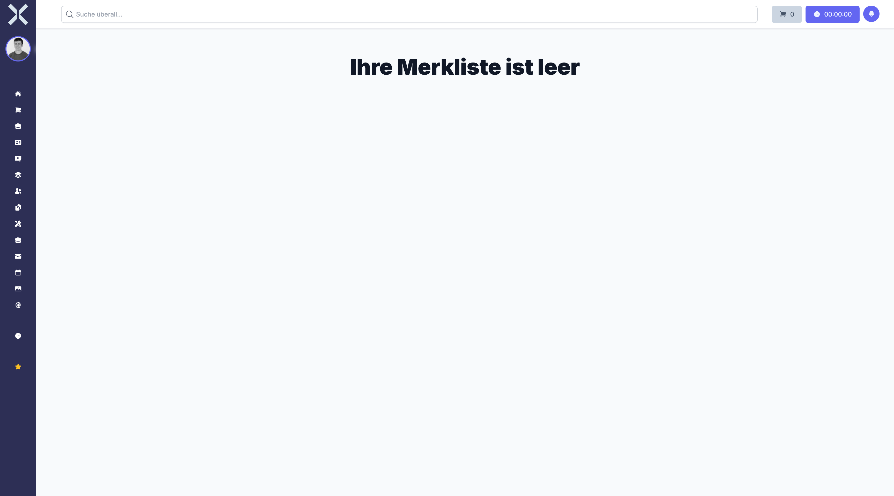

# Watchlists

Watchlists allow you to save items for later reference. You can add products, orders or other records to your personal watchlist and access them quickly at any time.

## Open Watchlists

1. Click the **star** icon in the sidebar to open your watchlists.

   

## Add Items to a Watchlist

1. Navigate to the detail view of any record (e.g. a product or order).
2. Click the **watchlist** icon to add the item to your watchlist.

## Remove Items

1. Open your watchlist.
2. Click the **remove** icon next to the item you want to remove.

## Empty Watchlist

When no items have been added yet, the watchlist shows a message indicating that it is empty.

## Related Topics

- [Navigation](2-navigation.md) - Sidebar and global search
- [Dashboard](3-dashboard.md) - Overview of your tasks and activities
