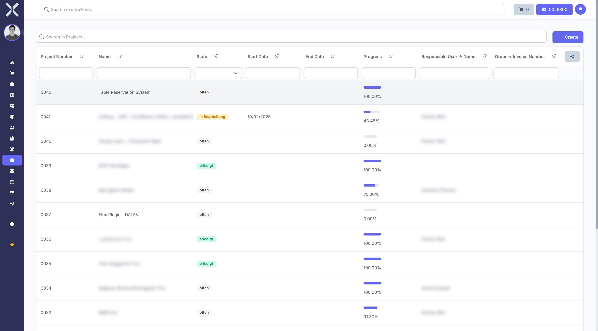

# Projects

In the **Projects** module you manage your projects and track their progress.

## Overview

Navigate to **Projects** via the sidebar. You will see a tabular overview of all projects.

The table contains the following columns:

- **Project Number** - Unique project number
- **Name** - Project name
- **Status** - Current status (open, in progress, completed)
- **Start Date** - Planned project start
- **End Date** - Planned project end
- **Progress** - Percentage progress of the project
- **Responsible** - Person responsible for the project
- **Order** - Linked order number

## Features

- **Search** - Search projects by name, number or responsible person.
- **Status Filter** - Filter projects by status (open, in progress, completed).
- **New Project** - Click **New** to create a new project.

## Project Details

Click on a project to open the detail view. There you will find:

- **Project Data** - All master data of the project
- **Tasks** - Assigned tasks with status and progress
- **Time Tracking** - Recorded working hours for the project

## Pages in this Chapter

- [Manage Projects](1-manage-projects.md) - Project list, search and filters
- [Project Details](2-project-detail.md) - Detail view of a project

## Related Topics

- [Tasks](../8-tasks/0-index.md) - Manage tasks within projects
- [Orders](../4-orders/0-index.md) - View linked orders
