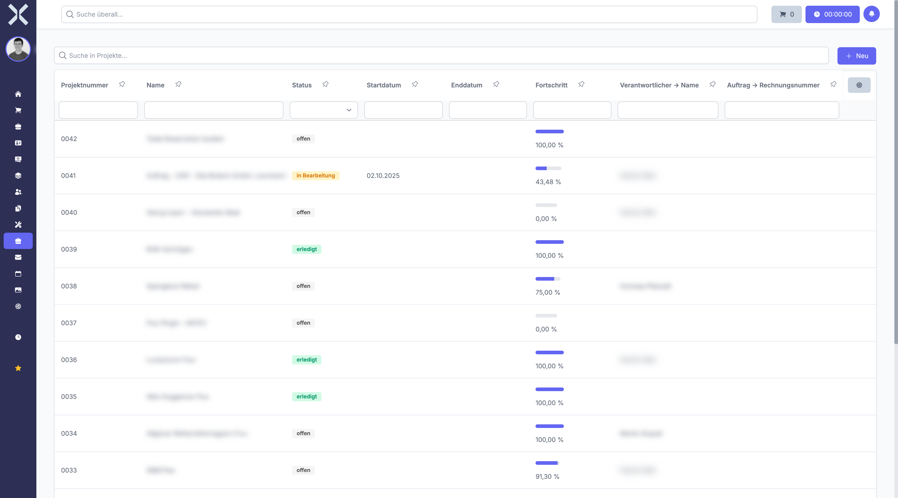

# Manage Projects

The project list shows all projects and their progress.

## Open the Project List

1. Click **Projects** in the sidebar.

   

2. The table shows all projects with the following columns:
   - **Project Number** - Unique number
   - **Name** - Project name
   - **Status** - Current status
   - **Start Date / End Date** - Planned period
   - **Progress** - Percentage progress
   - **Responsible** - Project manager

## Filter Projects

- Use the search field to find projects by name or number.
- Filter by status (open, in progress, done).

## Create a New Project

1. Click **New**.
2. Enter the project name and description.
3. Set start and end dates.
4. Assign a responsible person.
5. Click **Save**.

## Related Topics

- [Project Details](2-project-detail.md) - View a single project in detail
- [Tasks](../8-tasks/0-index.md) - Tasks within projects
