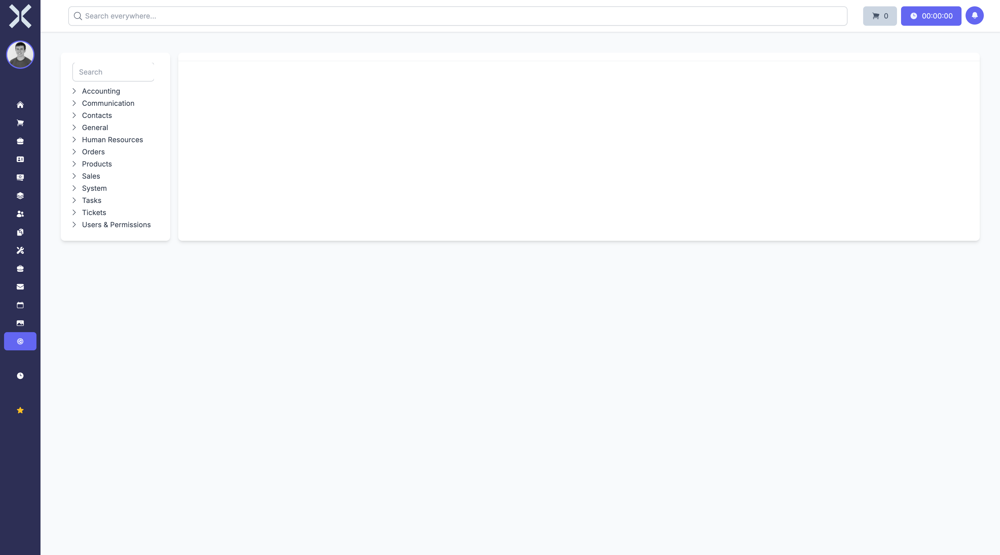

# Settings

In the **Settings** module you configure Nuxbe to suit your requirements.

## Overview

Navigate to **Settings** via the sidebar. You will see an overview of all settings areas.

The settings are divided into the following categories:

- **General** - Basic system settings
- **Orders** - Settings for order types, number ranges and more
- **Users & Permissions** - User management and permissions
- **Accounting** - Chart of accounts, tax rates and payment types
- **Communication** - Email templates and notifications
- **Contacts** - Settings for contact management
- **Human Resources** - HR module configuration
- **Products** - Product categories and units
- **Tickets** - Ticket types and workflows
- **Sales** - Sales settings and price lists
- **System** - System-wide settings and maintenance

## Features

- **Search** - Search settings by keyword.
- **Edit** - Click on a category to view and edit the associated settings.

## Pages in this Chapter

### General

- [Categories](1-categories.md) - Manage categories
- [Countries](2-countries.md) - Manage countries
- [Country Regions](3-country-regions.md) - Manage regions
- [Currencies](4-currencies.md) - Manage currencies
- [Languages](5-languages.md) - Manage languages
- [Tags](6-tags.md) - Manage tags
- [Tenants](7-tenants.md) - Manage tenants
- [Record Origins](8-record-origins.md) - Manage data sources
- [Industries](9-industries.md) - Manage industries
- [Locations](10-locations.md) - Manage locations

### Orders

- [Order Types](11-order-types.md) - Manage order types
- [Payment Types](12-payment-types.md) - Manage payment types
- [Discount Groups](13-discount-groups.md) - Manage discount groups
- [Subscription Settings](14-subscription-settings.md) - Subscription settings
- [Price Lists](15-price-lists.md) - Manage price lists

### Users & Permissions

- [Users](16-users.md) - Manage users
- [Permissions](17-permissions.md) - Manage permissions
- [API Tokens](18-api-tokens.md) - Manage API tokens

### Accounting

- [Ledger Accounts](19-ledger-accounts.md) - Manage ledger accounts
- [VAT Rates](20-vat-rates.md) - Manage VAT rates
- [Bank Connections](21-bank-connections.md) - Manage bank connections
- [Accounting Settings](22-accounting-settings.md) - Accounting settings
- [Payment Reminder Texts](23-payment-reminder-texts.md) - Manage reminder texts
- [Reminder Settings](24-reminder-settings.md) - Reminder settings

### Communication

- [Email Templates](25-email-templates.md) - Manage email templates
- [Mail Accounts](26-mail-accounts.md) - Manage mail accounts
- [Notifications](27-notifications.md) - Configure notifications

### Contacts

- [Address Types](28-address-types.md) - Manage address types

### Human Resources

- [Employee Departments](29-employee-departments.md) - Manage departments
- [Absence Types](30-absence-types.md) - Manage absence types
- [Absence Policies](31-absence-policies.md) - Absence policies
- [Holidays](32-holidays.md) - Manage holidays
- [Vacation Blackouts](33-vacation-blackouts.md) - Manage vacation blackouts
- [Vacation Carryover Rules](34-vacation-carryover-rules.md) - Vacation carryover rules
- [Work Time Models](35-work-time-models.md) - Manage work time models
- [Work Time Types](36-work-time-types.md) - Manage work time types

### Products

- [Units](37-units.md) - Manage units
- [Product Option Groups](38-product-option-groups.md) - Product option groups
- [Product Properties](39-product-properties.md) - Product properties
- [Serial Number Ranges](40-serial-number-ranges.md) - Serial number ranges
- [Warehouses](41-warehouses.md) - Manage warehouses

### Tickets

- [Ticket Types](42-ticket-types.md) - Manage ticket types
- [Ticket Settings](43-ticket-settings.md) - Ticket settings

### Sales

- [Lead States](44-lead-states.md) - Manage lead states
- [Lead Loss Reasons](45-lead-loss-reasons.md) - Lead loss reasons
- [Targets](46-targets.md) - Manage sales targets

### System

- [Core Settings](47-core-settings.md) - Core settings
- [System](48-system.md) - System settings
- [Plugins](49-plugins.md) - Manage plugins
- [Scheduling](50-scheduling.md) - Scheduling
- [Queue Monitor](51-queue-monitor.md) - Queue monitor
- [Failed Jobs](52-failed-jobs.md) - Failed jobs
- [Activity Logs](53-activity-logs.md) - Activity logs
- [Logs](54-logs.md) - System logs
- [Print Jobs](55-print-jobs.md) - Print jobs
- [Printers](56-printers.md) - Manage printers

> **Note:** Changes to the settings can affect the entire application. Only make changes if you are aware of their implications.
