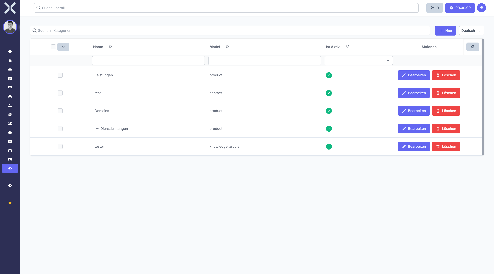

# Categories

Manage categories used across different modules such as products, contacts and knowledge articles.

## Open Categories

1. Navigate to **Settings > General > Categories**.

   

2. The table shows all categories with the following columns:
   - **Name** - Category name (subcategories are indented)
   - **Model** - Module the category belongs to (e.g. product, contact)
   - **Is Active** - Whether the category is enabled

## Create a Category

1. Click **New**.
2. Enter a name, select the target model and set the active state.
3. Click **Save**.

## Edit or Delete

- Click **Edit** to modify an existing category.
- Click **Delete** to remove a category.

## Related Topics

- [Settings](0-index.md) - Back to the settings overview
