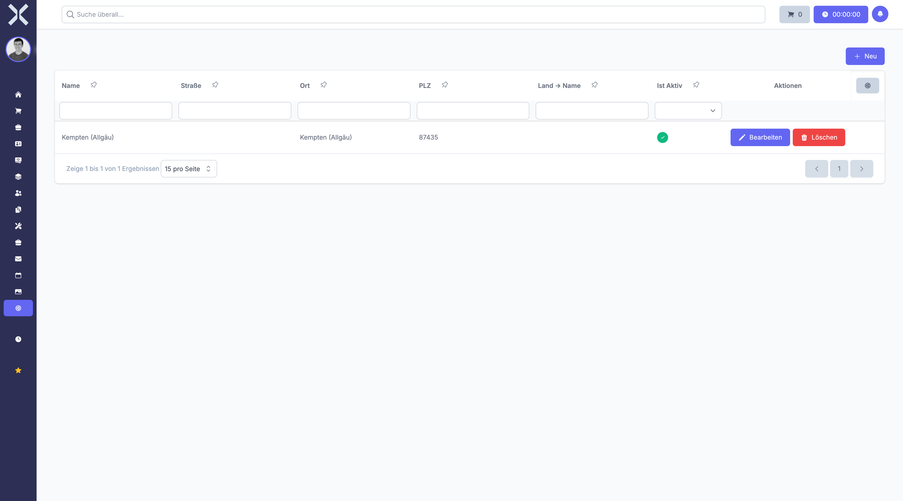

# Locations

Manage physical locations such as offices or warehouses.

## Open Locations

1. Navigate to **Settings > General > Locations**.

   

2. The table shows all locations with the following columns:
   - **Name** - Location name
   - **Street** - Street address
   - **City** - City
   - **Postal Code** - Postal code
   - **Country** - Country
   - **Is Active** - Whether the location is enabled

## Create a Location

1. Click **New**.
2. Enter the name and address details.
3. Click **Save**.

## Edit or Delete

- Click **Edit** to modify an existing location.
- Click **Delete** to remove a location.

## Related Topics

- [Settings](0-index.md) - Back to the settings overview
