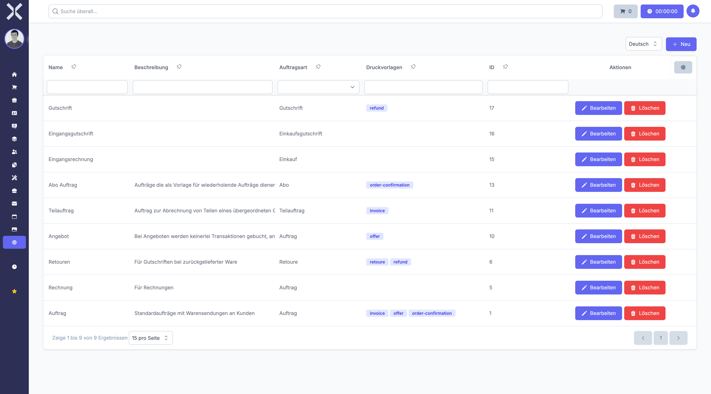

# Order Types

Manage the different order types such as quotes, orders, invoices and credit notes. Each type has its own number ranges, print templates and workflow settings.

## Open Order Types

1. Navigate to **Settings > Orders > Order Types**.

   

2. The table shows all order types with the following columns:
   - **Name** - Order type name
   - **Description** - Purpose of the order type
   - **Order Category** - Category grouping (e.g. Order, Credit Note, Purchase)
   - **Print Templates** - Assigned print templates
   - **ID** - Internal identifier

## Create an Order Type

1. Click **New**.
2. Enter a name, description and select the order category.
3. Configure number ranges and assign print templates.
4. Click **Save**.

## Edit or Delete

- Click **Edit** to modify an existing order type.
- Click **Delete** to remove an order type.

## Related Topics

- [Orders](../4-orders/0-index.md) - Manage orders
- [Settings](0-index.md) - Back to the settings overview
