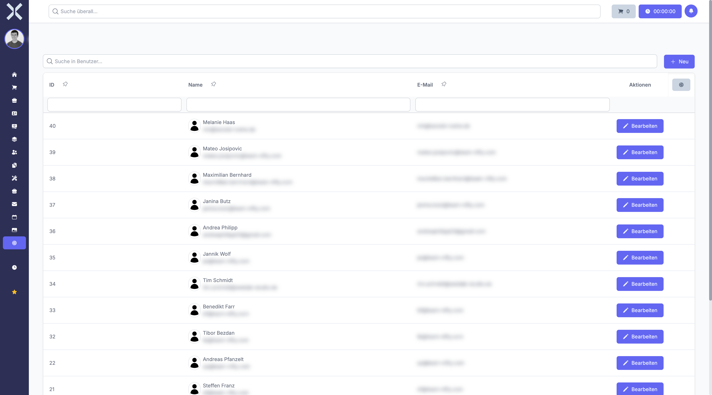

# Users

Manage user accounts that have access to the system.

## Open Users

1. Navigate to **Settings > Users & Permissions > Users**.

   

2. The table shows all users with the following columns:
   - **ID** - User identifier
   - **Name** - Full name
   - **E-Mail** - Email address

## Create a User

1. Click **New**.
2. Enter the name and email address.
3. Set a password.
4. Assign roles and permissions.
5. Click **Save**.

## Edit

- Click **Edit** to update a user's details or permissions.

## Related Topics

- [Permissions](17-permissions.md) - Manage roles and permissions
- [Settings](0-index.md) - Back to the settings overview
