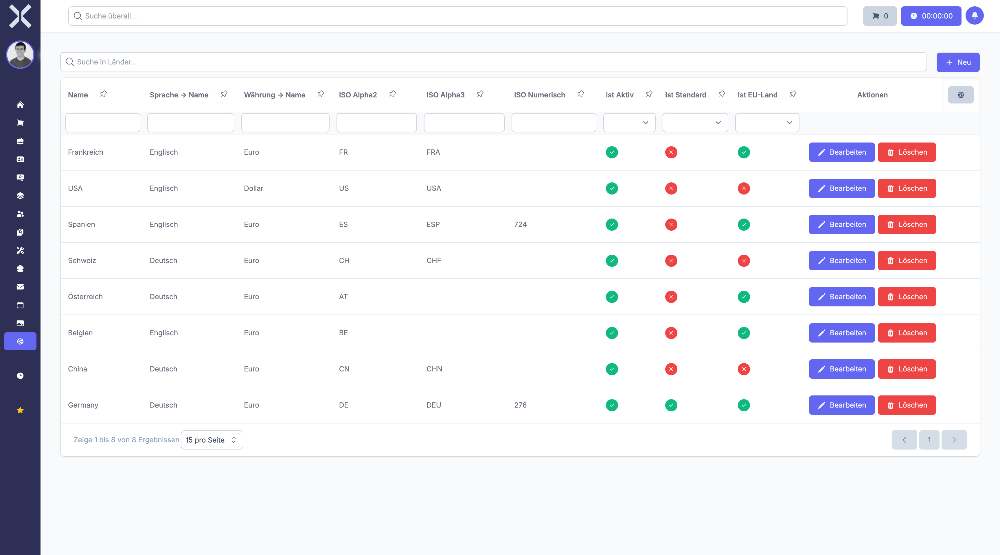

# Countries

Manage the list of countries available throughout the system for addresses, contacts and orders.

## Open Countries

1. Navigate to **Settings > General > Countries**.

   

2. The table shows all countries with the following columns:
   - **Name** - Country name
   - **Language** - Default language
   - **Currency** - Default currency
   - **ISO Alpha2 / Alpha3** - ISO country codes
   - **ISO Numeric** - Numeric ISO code
   - **Is Active** - Whether the country is enabled
   - **Is Default** - Whether it is the default country
   - **Is EU Country** - EU membership flag

## Create a Country

1. Click **New**.
2. Fill in the country details and ISO codes.
3. Click **Save**.

## Edit or Delete

- Click **Edit** to modify an existing country.
- Click **Delete** to remove a country.

## Related Topics

- [Country Regions](3-country-regions.md) - Manage regions within countries
- [Settings](0-index.md) - Back to the settings overview
