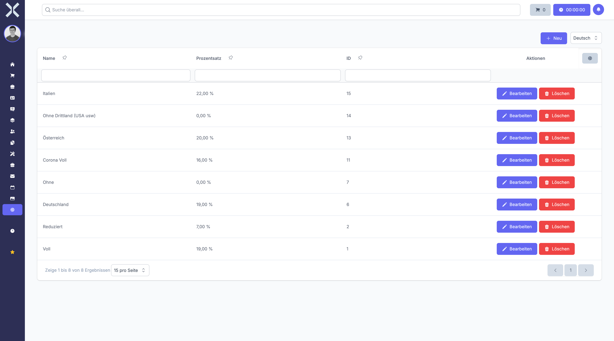

# VAT Rates

Manage the tax rates applied to orders and invoices.

## Open VAT Rates

1. Navigate to **Settings > Accounting > VAT Rates**.

   

2. The table shows all VAT rates with the following columns:
   - **Name** - Rate name (e.g. Standard, Reduced)
   - **Percentage** - Tax percentage
   - **ID** - Internal identifier

## Create a VAT Rate

1. Click **New**.
2. Enter a name and the percentage.
3. Click **Save**.

## Edit or Delete

- Click **Edit** to modify an existing rate.
- Click **Delete** to remove a rate.

## Related Topics

- [Accounting](../5-accounting/0-index.md) - Use the accounting module
- [Settings](0-index.md) - Back to the settings overview
