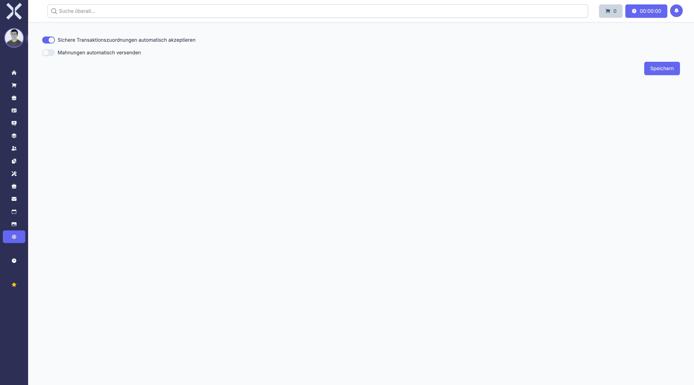

# Accounting Settings

Configure general accounting behaviour such as automatic transaction assignment and reminder dispatch.

## Open Accounting Settings

1. Navigate to **Settings > Accounting > Accounting Settings**.

   

2. The form contains:
   - **Auto-accept secure transaction assignments** - Automatically accept assignments when a match is certain
   - **Send reminders automatically** - Dispatch payment reminders without manual confirmation

## Save Changes

1. Toggle the options as needed.
2. Click **Save**.

## Related Topics

- [Accounting](../5-accounting/0-index.md) - Use the accounting module
- [Settings](0-index.md) - Back to the settings overview
