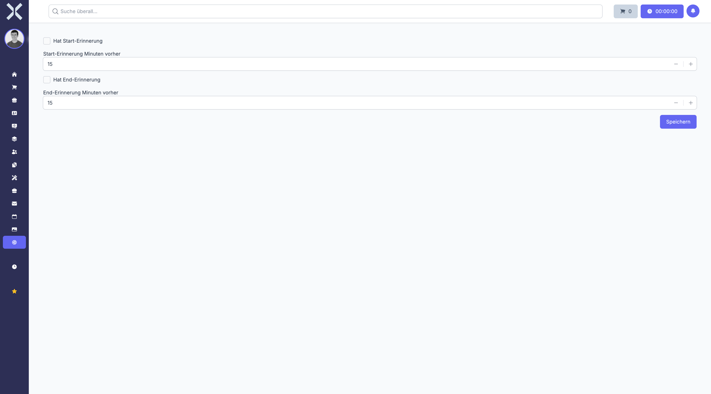

# Reminder Settings

Configure calendar event reminders for start and end times.

## Open Reminder Settings

1. Navigate to **Settings > Accounting > Reminder Settings**.

   

2. The form contains:
   - **Has Start Reminder** - Enable a reminder before an event starts
   - **Start Reminder Minutes Before** - Minutes before the start
   - **Has End Reminder** - Enable a reminder before an event ends
   - **End Reminder Minutes Before** - Minutes before the end

## Save Changes

1. Toggle reminders on or off and set the lead times.
2. Click **Save**.

## Related Topics

- [Settings](0-index.md) - Back to the settings overview
