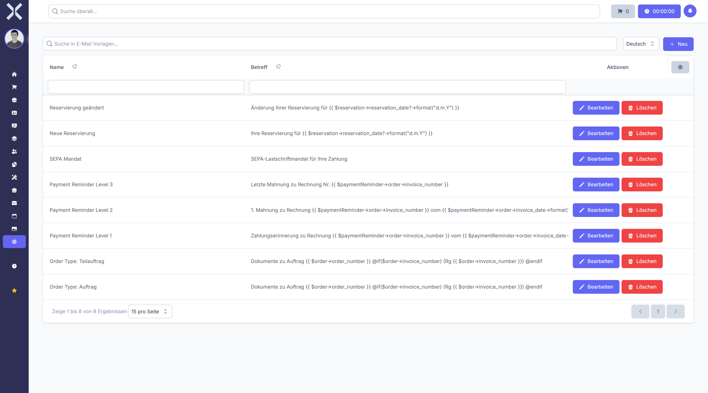

# Email Templates

Manage reusable email templates for order confirmations, reminders and other automated messages.

## Open Email Templates

1. Navigate to **Settings > Communication > Email Templates**.

   

2. The table shows all templates with the following columns:
   - **Name** - Template name
   - **Subject** - Email subject line with optional placeholders

## Create a Template

1. Click **New**.
2. Enter a name and compose the subject and body. Use placeholders for dynamic values.
3. Click **Save**.

## Edit or Delete

- Click **Edit** to modify an existing template.
- Click **Delete** to remove a template.

## Related Topics

- [Email](../11-email/0-index.md) - Use the email module
- [Settings](0-index.md) - Back to the settings overview
