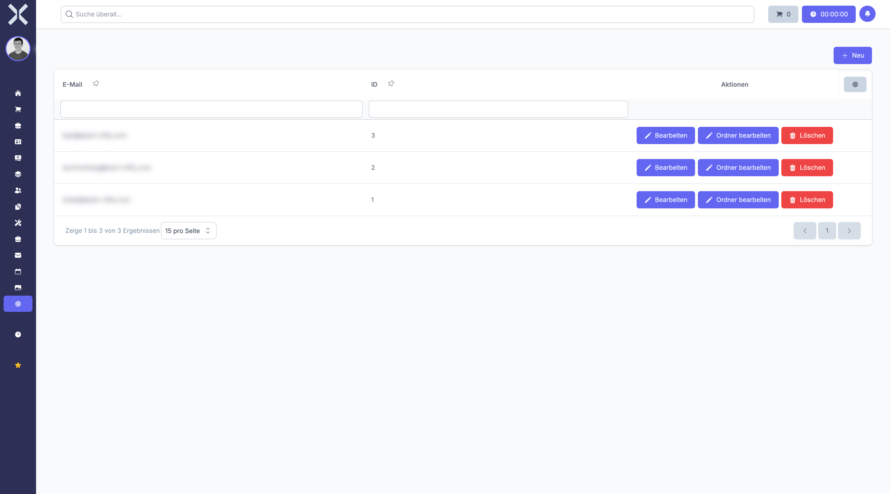

# Mail Accounts

Manage the email accounts used by the system to send and receive messages.

## Open Mail Accounts

1. Navigate to **Settings > Communication > Mail Accounts**.

   

## Create a Mail Account

1. Click **New**.
2. Enter the server details (SMTP / IMAP), credentials and display name.
3. Click **Save**.

## Edit or Delete

- Click **Edit** to update connection settings.
- Click **Delete** to remove a mail account.

## Related Topics

- [Email](../11-email/0-index.md) - Use the email module
- [Settings](0-index.md) - Back to the settings overview
