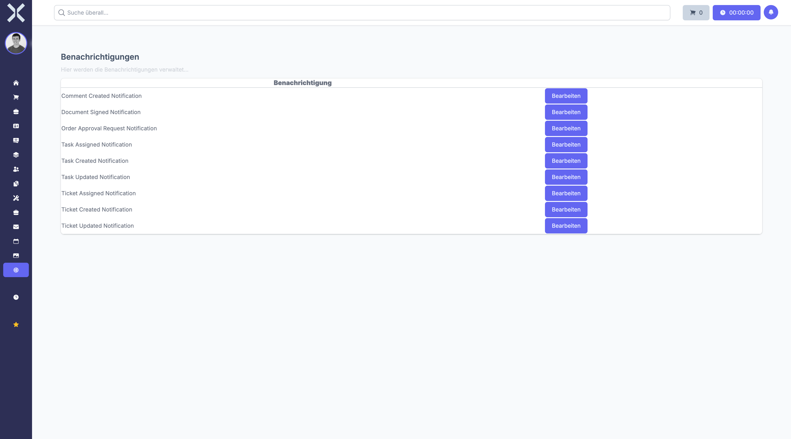

# Notifications

Configure which events trigger notifications and how they are delivered.

## Open Notifications

1. Navigate to **Settings > Communication > Notifications**.

   

## Configure Notifications

1. Enable or disable notification channels for each event type.
2. Click **Save**.

## Related Topics

- [Settings](0-index.md) - Back to the settings overview
