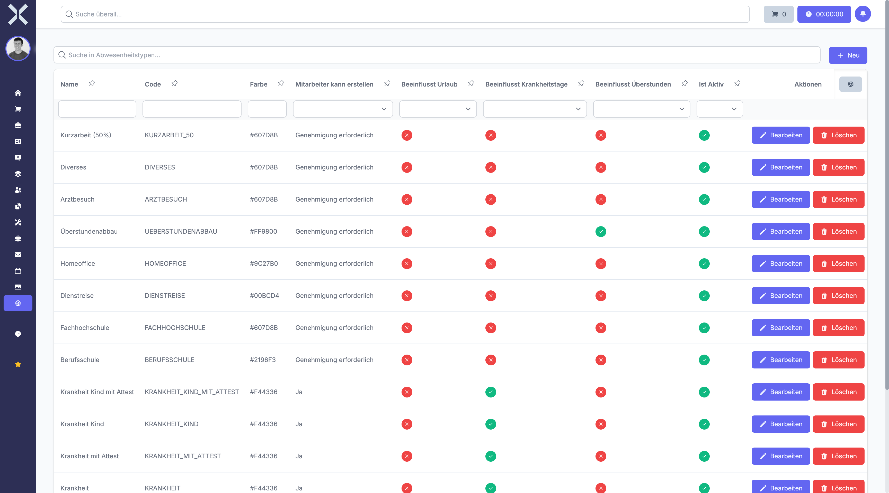

# Absence Types

Manage the types of absences employees can request, such as vacation, sick leave or special leave.

## Open Absence Types

1. Navigate to **Settings > Human Resources > Absence Types**.

   

## Create an Absence Type

1. Click **New**.
2. Enter a name and configure the type's properties.
3. Click **Save**.

## Edit or Delete

- Click **Edit** to modify an existing absence type.
- Click **Delete** to remove an absence type.

## Related Topics

- [Absence Requests](../7-human-resources/6-absence-requests.md) - Submit absence requests
- [Settings](0-index.md) - Back to the settings overview
