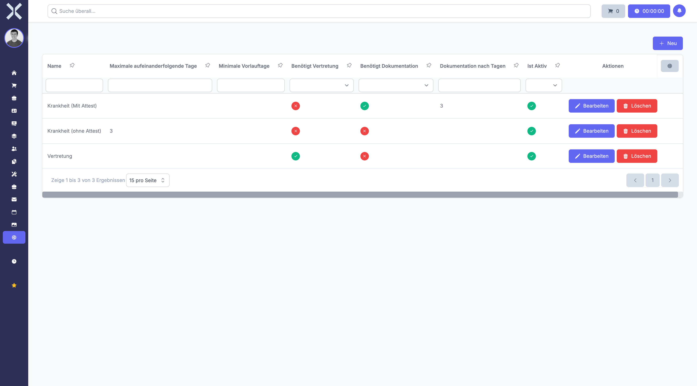

# Absence Policies

Define policies that control how many absence days employees receive per year and how they are accrued.

## Open Absence Policies

1. Navigate to **Settings > Human Resources > Absence Policies**.

   

## Create a Policy

1. Click **New**.
2. Configure the entitlement rules for the policy.
3. Click **Save**.

## Edit or Delete

- Click **Edit** to modify an existing policy.
- Click **Delete** to remove a policy.

## Related Topics

- [Absence Requests](../7-human-resources/6-absence-requests.md) - Submit absence requests
- [Settings](0-index.md) - Back to the settings overview
