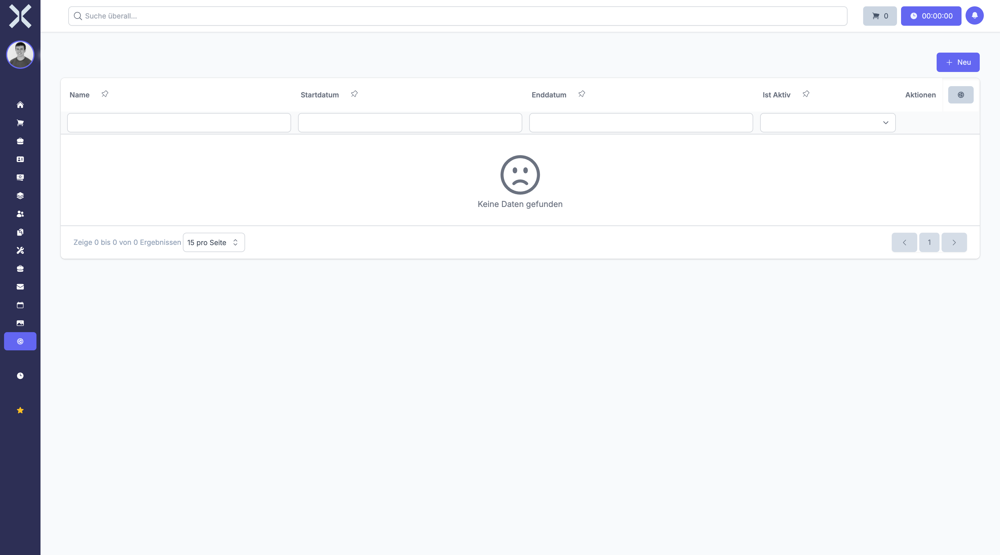

# Vacation Blackouts

Define periods during which employees cannot request vacation.

## Open Vacation Blackouts

1. Navigate to **Settings > Human Resources > Vacation Blackouts**.

   

## Create a Blackout Period

1. Click **New**.
2. Set the start and end dates.
3. Click **Save**.

## Edit or Delete

- Click **Edit** to modify an existing blackout period.
- Click **Delete** to remove a blackout period.

## Related Topics

- [Absence Requests](../7-human-resources/6-absence-requests.md) - Submit absence requests
- [Settings](0-index.md) - Back to the settings overview
