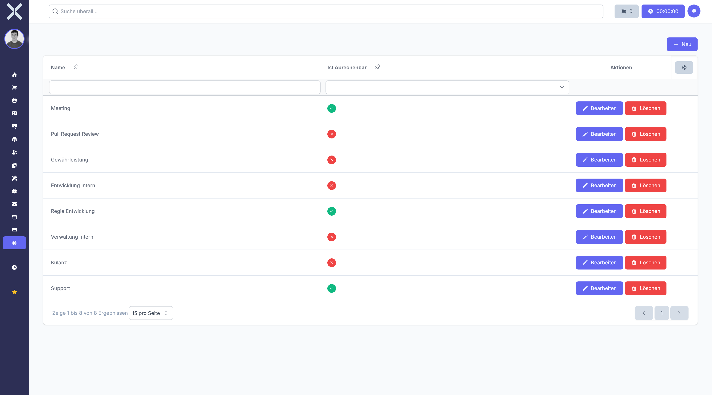

# Work Time Types

Manage the types of work time entries employees can log, such as regular work, overtime or on-call.

## Open Work Time Types

1. Navigate to **Settings > Human Resources > Work Time Types**.

   

## Create a Work Time Type

1. Click **New**.
2. Enter a name and configure the type's properties.
3. Click **Save**.

## Edit or Delete

- Click **Edit** to modify an existing type.
- Click **Delete** to remove a type.

## Related Topics

- [Working Hours](../7-human-resources/5-working-hours.md) - Track working hours
- [Settings](0-index.md) - Back to the settings overview
