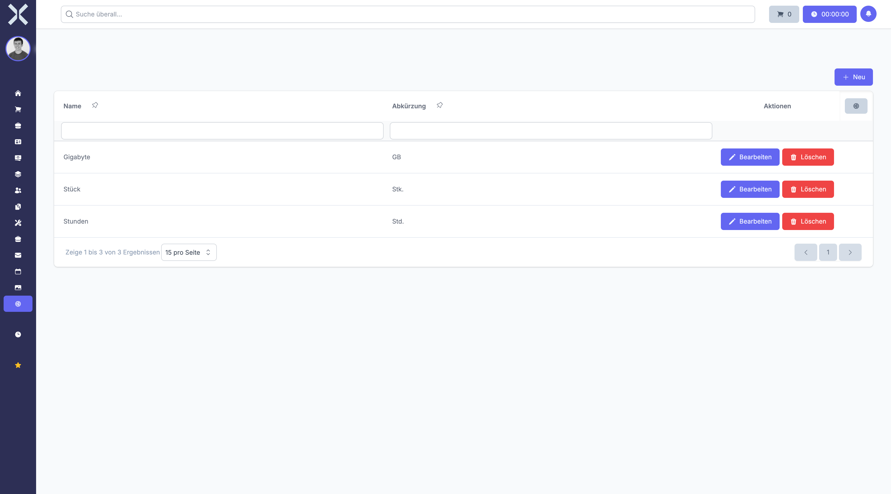

# Units

Manage units of measure used for products, such as pieces, hours or kilograms.

## Open Units

1. Navigate to **Settings > Products > Units**.

   

## Create a Unit

1. Click **New**.
2. Enter a name and abbreviation.
3. Click **Save**.

## Edit or Delete

- Click **Edit** to modify an existing unit.
- Click **Delete** to remove a unit.

## Related Topics

- [Products](../6-products/0-index.md) - Manage products
- [Settings](0-index.md) - Back to the settings overview
