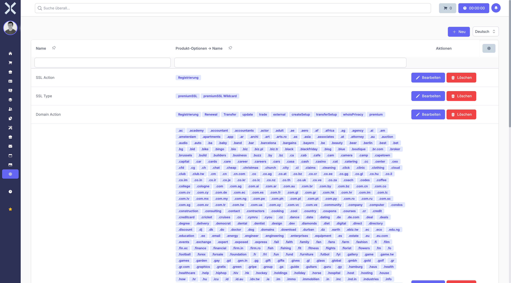

# Product Option Groups

Manage option groups that define selectable product variants such as size or colour.

## Open Product Option Groups

1. Navigate to **Settings > Products > Product Option Groups**.

   

## Create an Option Group

1. Click **New**.
2. Enter a name and add the available options.
3. Click **Save**.

## Edit or Delete

- Click **Edit** to modify an existing group.
- Click **Delete** to remove a group.

## Related Topics

- [Products](../6-products/0-index.md) - Manage products
- [Settings](0-index.md) - Back to the settings overview
