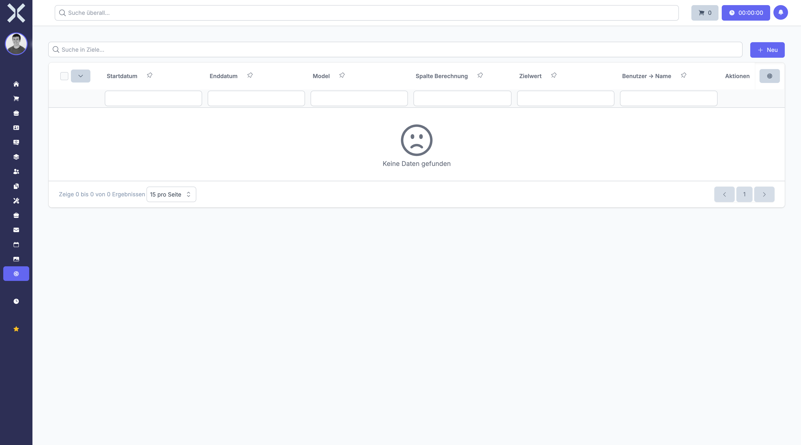

# Targets

Define sales targets for teams or individual users to track performance.

## Open Targets

1. Navigate to **Settings > Sales > Targets**.

   

## Create a Target

1. Click **New**.
2. Set the target value, period and assigned user or team.
3. Click **Save**.

## Edit or Delete

- Click **Edit** to modify an existing target.
- Click **Delete** to remove a target.

## Related Topics

- [Sales](../3-sales/0-index.md) - Manage leads
- [Settings](0-index.md) - Back to the settings overview
