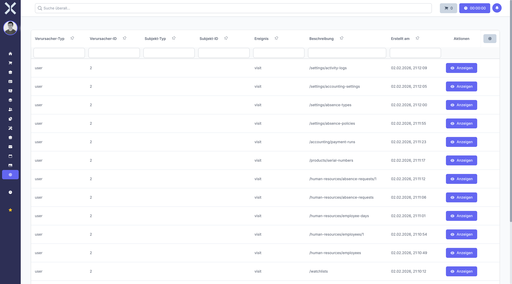

# Activity Logs

View a chronological log of all changes made to records throughout the system.

## Open Activity Logs

1. Navigate to **Settings > System > Activity Logs**.

   

2. The table shows log entries with the user, action, affected record and timestamp.

## Filter Logs

Use the column filters to narrow results by user, model or date range.

## Related Topics

- [Settings](0-index.md) - Back to the settings overview
