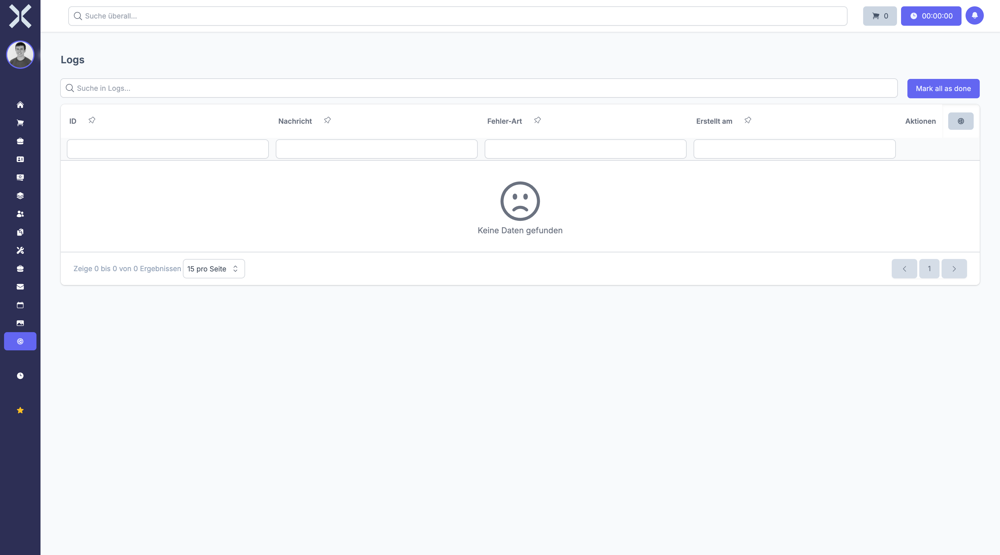

# Logs

View application log files for debugging and monitoring system errors.

## Open Logs

1. Navigate to **Settings > System > Logs**.

   

2. The log viewer shows entries from the application log files with severity, message and timestamp.

## Related Topics

- [Settings](0-index.md) - Back to the settings overview
