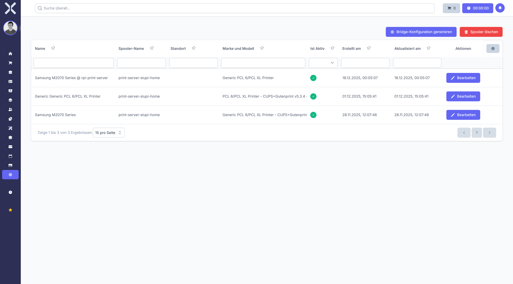

# Printers

Manage the printers connected to the system for direct printing of documents.

## Open Printers

1. Navigate to **Settings > System > Printers**.

   

## Add a Printer

1. Click **New**.
2. Enter the printer name and connection details.
3. Click **Save**.

## Edit or Delete

- Click **Edit** to modify printer settings.
- Click **Delete** to remove a printer.

## Related Topics

- [Print Jobs](55-print-jobs.md) - View print jobs
- [Settings](0-index.md) - Back to the settings overview
