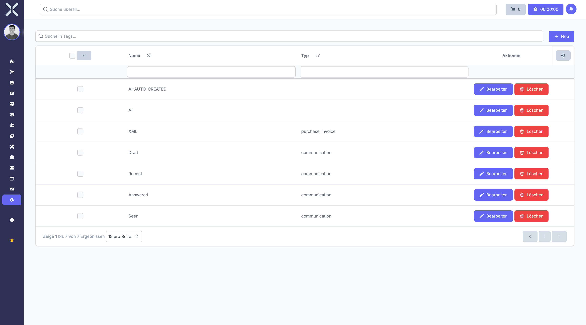

# Tags

Manage tags that can be attached to records across various modules for filtering and organisation.

## Open Tags

1. Navigate to **Settings > General > Tags**.

   

2. The table shows all tags with the following columns:
   - **Name** - Tag label
   - **Type** - Module the tag applies to (e.g. communication, purchase_invoice)

## Create a Tag

1. Click **New**.
2. Enter a name and optionally select a type.
3. Click **Save**.

## Edit or Delete

- Click **Edit** to modify an existing tag.
- Click **Delete** to remove a tag.

## Related Topics

- [Settings](0-index.md) - Back to the settings overview
