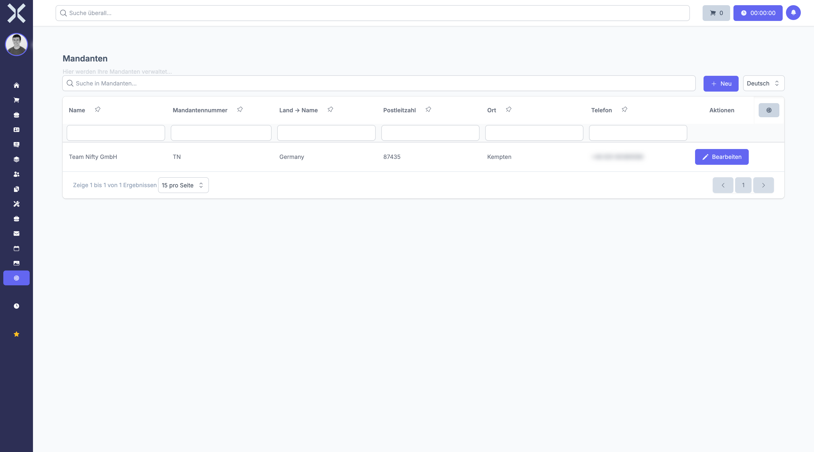

# Tenants

Manage your company data. Each tenant represents a legal entity within the system.

## Open Tenants

1. Navigate to **Settings > General > Tenants**.

   

2. The table shows all tenants with the following columns:
   - **Name** - Company name
   - **Tenant Number** - Short identifier
   - **Country** - Registered country
   - **Postal Code** - Postal code
   - **City** - City
   - **Phone** - Phone number

## Create a Tenant

1. Click **New**.
2. Enter the company name, address and contact details.
3. Click **Save**.

## Edit

- Click **Edit** to update a tenant's details such as tax number or VAT ID.

## Related Topics

- [Settings](0-index.md) - Back to the settings overview
