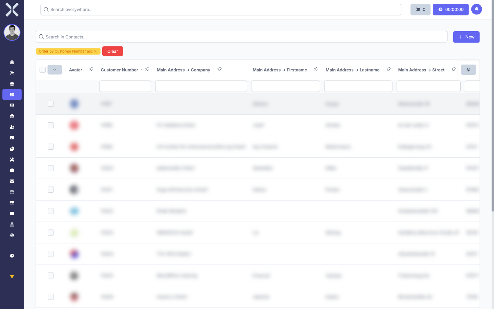
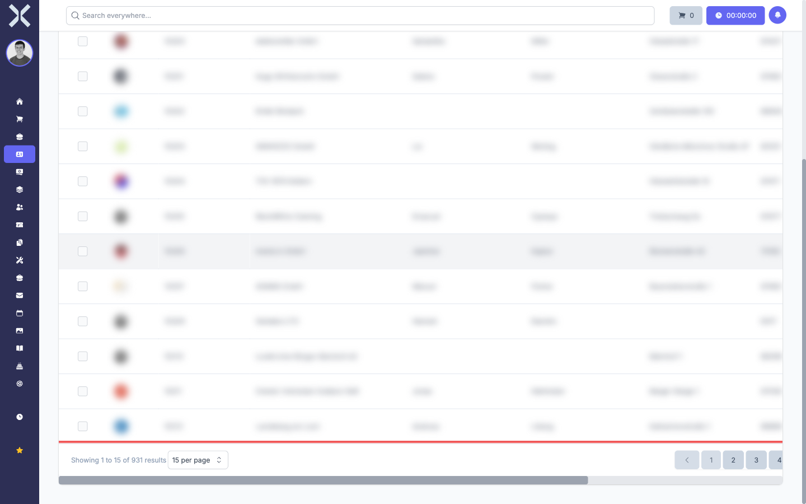

# Tables

Nuxbe uses interactive data tables in many places to display large amounts of data in a clear and structured way. These tables offer extensive features for searching, filtering, sorting, grouping, and exporting data. Whether you are looking at the contact list, order list, or product catalogue — the controls work the same everywhere.

## Overview

Every data table in Nuxbe consists of the following areas:

| Area | Description |
|---|---|
| **Search bar** | Full-text search across all visible columns |
| **Column headers** | Clickable to sort the data |
| **Filter row** | Input fields below the column headers for filtering individual columns |
| **Sidebar** | Expandable panel on the right with advanced functions for filters, columns, grouping, and export |
| **Table content** | The actual data rows with entries |
| **Pagination** | Navigation between pages at the bottom of the table |

## General Usage

The tables respond to your input in real time. As soon as you enter a search term, set a filter, or change the sort order, the display updates immediately. There is no need to reload the page manually.

All settings such as search terms, filters, sort order, and column selection are saved per table. When you leave the page and return later, you will find your previous configuration still in place.

## Pagination

At the bottom of every table you will find the page navigation.

The pagination shows the current page number and the total number of results. You can:

- Use the arrow buttons to navigate between pages.
- Enter a specific page number directly to jump to that page.
- Change the number of entries displayed per page using the dropdown.

> **Note:** Filters, search, and sort order affect the pagination. When you apply filters, the number of pages may decrease because fewer entries are shown.

## Pages in This Chapter

- [Search and Sort](1-search-and-sort.md) — Find entries using the search bar and sort by columns
- [Filtering](2-filtering.md) — Use column filters and saved filters
- [Customise Columns](3-customise-columns.md) — Configure visible columns and add relation columns
- [Summarise](4-summarise.md) — Calculate sums, averages, and other aggregations
- [Grouping](5-grouping.md) — Group data by columns
- [Exporting](6-exporting.md) — Export table contents as a file
- [Selecting Rows](7-selecting-rows.md) — Select one or more rows for actions

## Related Topics

- [Contacts](../2-contacts/0-index.md) — Contact list as an example of a data table
- [Orders](../4-orders/0-index.md) — Order list with data table
- [Products](../6-products/0-index.md) — Product catalogue in table form
