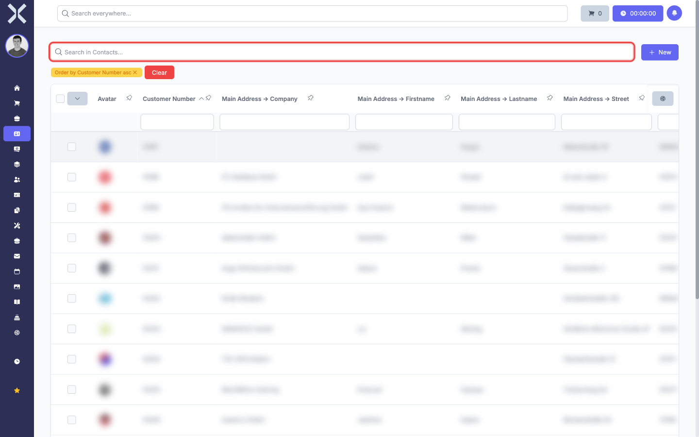
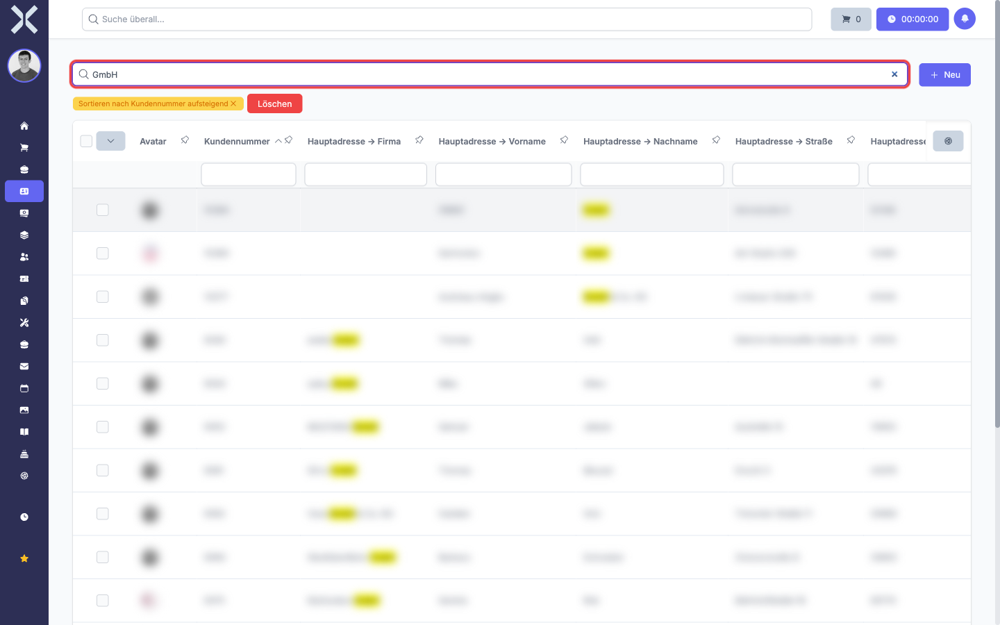
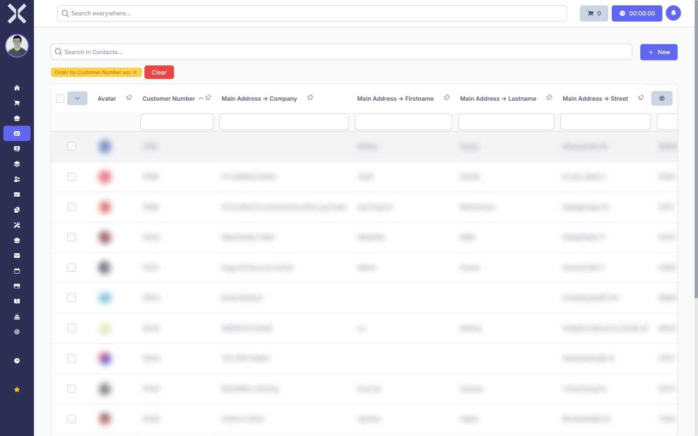

# Search and Sort

The search bar and sorting functions help you find specific entries quickly and arrange the data in a meaningful order.

## Searching with the Search Bar

The search bar is located at the top of every data table.

1. Click into the search bar and type your search term.

   

2. The table updates immediately as you type. Only entries that contain the search term in any of the visible columns are shown.

   

3. To clear the search, delete the text in the search bar. The table then shows all entries again.

> **Note:** The search only covers columns that are currently visible. If you are looking for content in a specific column, make sure that column is displayed. See [Customise Columns](3-customise-columns.md) for details.

## Sorting by a Column

You can sort the table by any column to arrange the data in ascending or descending order.

1. Click on a column header to sort the table by that column. A small badge appears next to the search bar showing the active sort order (e.g. "Order by Customer Number asc").

   

2. Click the same column header again to reverse the sort direction (from ascending to descending or vice versa).

3. To remove the sort order, click the badge next to the search bar or click the column header a third time.

## Combining Search and Sort

Search and sort work together. You can first search for a term to narrow down the results and then sort the remaining entries by a column. Both functions apply simultaneously.

## Related Topics

- [Filtering](2-filtering.md) — Narrow results further with column filters
- [Customise Columns](3-customise-columns.md) — Only visible columns are included in search results
