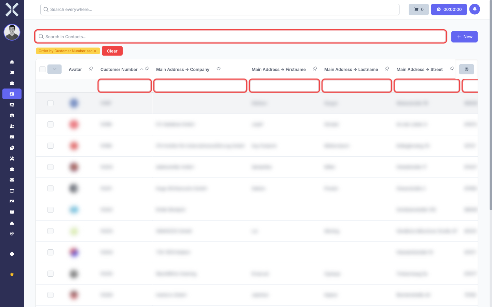
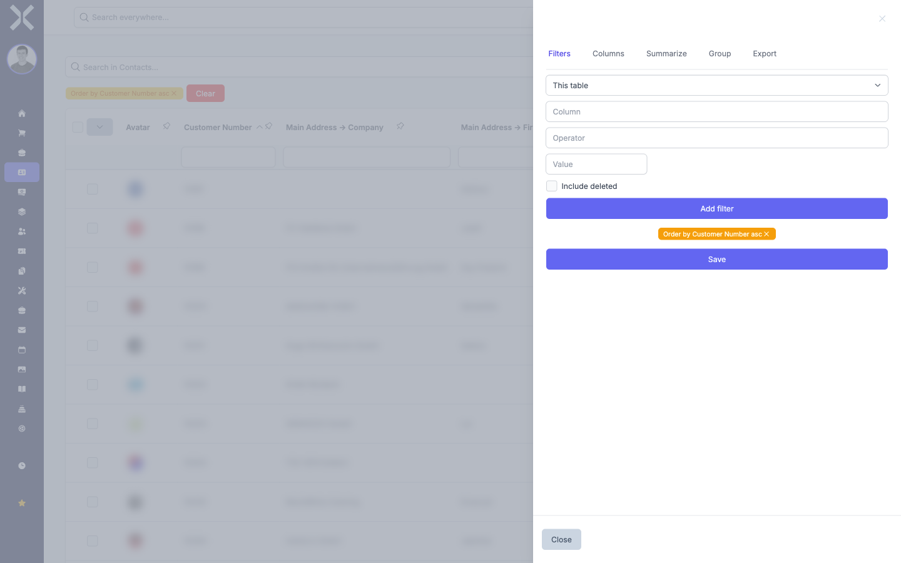

# Filtering

Filters let you narrow down the displayed data to exactly what you need. Nuxbe offers two types of filters: column filters directly in the table and advanced filters in the sidebar.

## Column Filters

Column filters are input fields located directly below the column headers. Each visible column has its own filter field.

1. Click into the filter field below the column you want to filter by.

2. Type your filter value. The table updates immediately and shows only entries that match your input in that column.

   

3. You can set filters on multiple columns at the same time. All filters are combined with AND logic — only entries that match all active filters are displayed.

4. To remove a column filter, clear the text in the corresponding filter field.

## Sidebar Filters

The sidebar provides advanced filter options that go beyond simple text matching. You can combine multiple conditions, use different operators, and save filter configurations for later use.

1. Click the icon on the right-hand side of the table to open the sidebar.

2. Select the **Filters** tab.

   

3. Click **Add filter** to create a new filter condition. You can choose:
   - The **column** to filter on
   - The **operator** (e.g. equals, contains, greater than, less than)
   - The **value** to compare against

4. Add additional filter conditions as needed. All conditions are combined — only entries that satisfy every condition are shown.

5. Click **Save** to save the current filter configuration. You can give it a name and load it later without having to set up the filters again.

6. To remove a filter condition, click the delete icon next to it. To remove all filters, click **Clear**.

## Combining Filters with Other Functions

Filters work together with all other table features:

- **Search:** The search bar and filters are applied simultaneously. Only entries that match both the search term and all filters are displayed.
- **Sort:** Sorting is applied to the filtered results.
- **Export:** The export includes only the filtered entries. See [Exporting](6-exporting.md).

> **Note:** When you set filters, the pagination may change because fewer entries are displayed. Check the pagination at the bottom if you cannot find an expected entry.

## Related Topics

- [Search and Sort](1-search-and-sort.md) — Combine search with filters for precise results
- [Exporting](6-exporting.md) — Export filtered data
