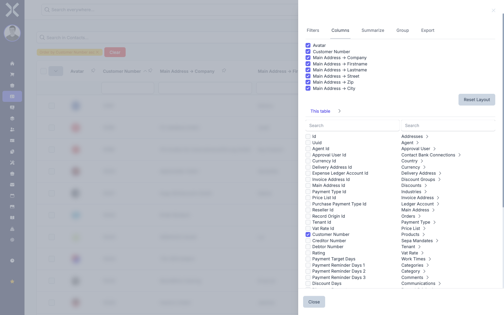
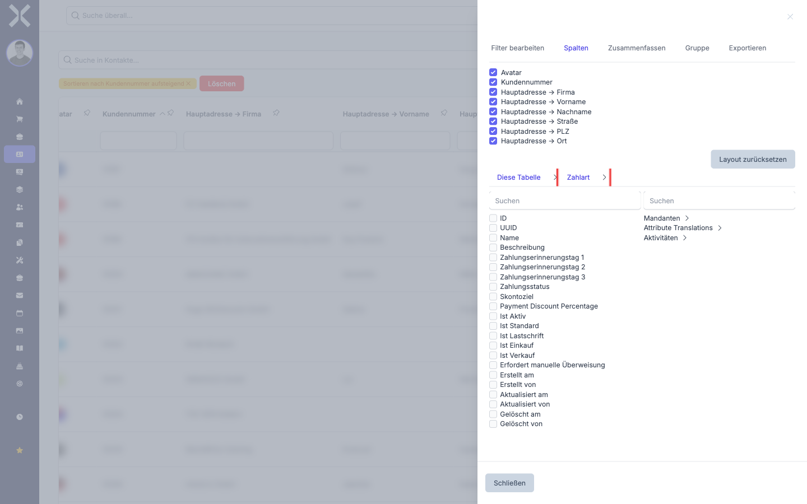

# Customise Columns

You can freely configure the visible columns of a table. Show or hide columns that are relevant to your work. You can also add columns from related records (relations) to see additional information directly in the table.

## Showing and Hiding Columns

1. Click the icon on the right-hand side of the table to open the sidebar.

2. Select the **Columns** tab.

   

3. You will see a list of all available columns, each with a checkbox next to it.

4. **Show a column:** Tick the checkbox next to the column you want to display.

5. **Hide a column:** Untick the checkbox next to the column.

6. The table updates immediately. The selected columns are shown, the deselected ones are hidden.

> **Note:** Hidden columns are not included in search results. If you want to search for content in a specific column, make sure that column is visible.

## Adding Relation Columns

In addition to the standard columns of a record, you can also add columns from related records (relations) to the table. This lets you see, for example, the name of the associated contact directly in the order list without having to open each order.

1. Open the sidebar and select the **Columns** tab.

2. Scroll down in the column list. Below the direct columns you will find sections for the available relations (e.g. **Contact**, **Address**, **Price List**).

3. Expand the desired relation to see its fields.

   

4. Tick the checkbox next to the field you want to add as a column.

5. The new column appears in the table. You can sort and filter it like any other column.

> **Note:** Relation columns may slightly increase the loading time of the table because additional data needs to be fetched. Only add the columns you actually need.

## Column Order

The order of columns in the table corresponds to the order in the column list in the sidebar. The first ticked columns appear on the left, later ones on the right.

## Pinning Columns

On wide tables you scroll sideways and easily lose track of which record a row belongs to. Pinned columns stay at the left edge while you scroll.

1. Point at the header of the column that should stay in place.

2. Click the **pin icon** in the header.

<!-- Screenshot: column header with the pin icon highlighted -->

3. The column moves to the left edge and stays there while you scroll the rest of the table. The pin icon stays highlighted.

4. Click the pin icon again to release the column.

You can pin several columns at once, for example document number and contact in the order list.

> **Note:** Do not pin too many columns. The pinned area reduces the space left for scrolling.

## Changing Column Width

You can drag every column to the width you need.

1. Point at the right edge of a column header. The cursor turns into a resize cursor.

2. Drag left or right with the mouse button held down.

<!-- Screenshot: drag handle at the right edge of a column header -->

3. Release the mouse button. The width applies immediately.

The widths belong to your personal view and are restored the next time you open the table. **Reset layout** (see below) discards them along with the other column settings.

## Saving, Sharing and Resetting the Layout

Your column settings are saved **automatically** for your personal account. There is nothing to save by hand -- if you show or hide a column, Nuxbe keeps it that way the next time you open the table. This personal view takes precedence over the tenant default.

At the top of the **Columns** tab you will find two buttons that control your view.

<!-- Screenshot: Columns tab with the Reset layout and Set as default buttons -->

### Reset layout -- back to the tenant default

1. Open the sidebar and select the **Columns** tab.
2. Click **Reset layout** at the top left.

<!-- Screenshot: Reset layout button highlighted -->

3. Your personal setting is discarded. The table falls back to the **tenant default**, the view your administrator defined for everyone (see the next section). If no tenant default is set, you see the factory default view.

> **Note:** This button affects **you** only, not other users. It is also the remedy when someone says: *"The table looks completely different on my screen than on my colleague's"* -- in that case one of the two has saved a personal view, and a click on **Reset layout** brings the standard view back.

### Set as default -- for all users in the tenant

This button is reserved for administrators and affects **all users** of your tenant who have not saved a personal view yet.

1. First set up your column view the way it should apply to everyone: show the columns you want, hide the ones you do not need, add suitable relation columns.

2. Click **Set as default** at the top right.

<!-- Screenshot: Set as default button highlighted -->

3. Your current column configuration is stored as the tenant default.

**What this means for other users:**

- Users **without** a personal view see the new view automatically the next time they open the table.
- Users **with** a personal view (everyone who ever showed or hid a column) notice no difference. They reach the new tenant default only after clicking **Reset layout**.

> **Note:** There is currently **no** tool that lets an administrator enforce or reset the personal layouts of all users. So if you set a new default and everyone should see it right away, each user has to click **Reset layout** themselves. Tell your team when you change a table.

> **Tip:** Both buttons only affect the table you are currently in. A default view set in the order list has no effect on the contact list or the invoice list -- every table has its own default.

## Related Topics

- [Search and Sort](1-search-and-sort.md) — Only visible columns are included in search results
- [Filtering](2-filtering.md) — Column filters are available for visible columns
- [Exporting](6-exporting.md) — You can also select columns for the export
