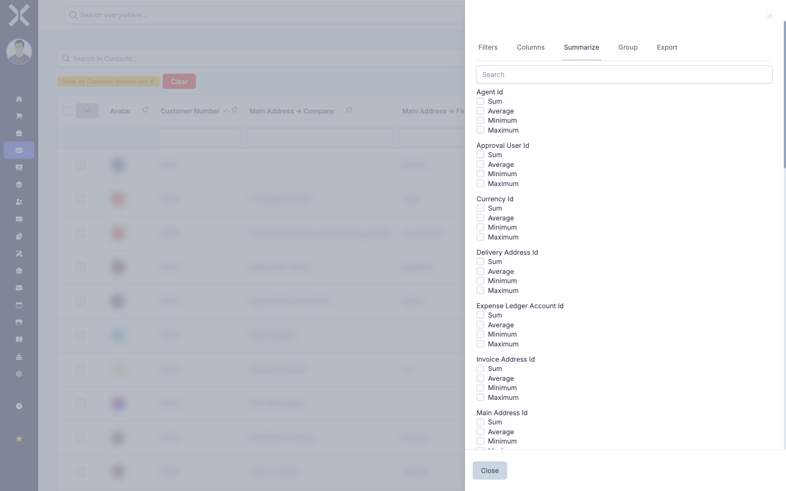

# Summarise

The summarise function lets you create statistical evaluations across the numeric columns of a table. You can calculate sums, averages, minimum and maximum values without having to export the data.

## Activating Summaries

1. Click the icon on the right-hand side of the table to open the sidebar.

2. Select the **Summarize** tab.

   

3. You will see a list of all numeric columns. Each column offers four checkboxes for different calculations:

   | Calculation | Description |
   |---|---|
   | **Sum** | Adds up all values in the column |
   | **Average** | Calculates the mean of all values |
   | **Minimum** | Shows the smallest value in the column |
   | **Maximum** | Shows the largest value in the column |

4. Tick the checkboxes for the calculations you want. You can activate multiple calculations for the same column and calculations for different columns at the same time.

5. The results are displayed at the bottom of the table in a summary row.

## Searching for Columns

If the list of available columns is long, you can use the search field at the top of the tab to find a specific column quickly. Enter the column name or part of it to filter the list.

## Removing Summaries

1. Open the sidebar and select the **Summarize** tab.

2. Untick the checkboxes for the calculations you no longer need.

3. The summary row at the bottom of the table updates accordingly. If all calculations are deactivated, the summary row disappears.

## Combining Summaries with Other Functions

The summary takes into account the currently displayed data:

- **Filters and Search:** The calculation only covers the filtered or searched entries.
- **Grouping:** When combined with grouping, the summaries are calculated per group.
- **All pages:** The calculation covers all entries, not just the currently visible page.

## Related Topics

- [Grouping](5-grouping.md) — Calculate summaries per group
- [Filtering](2-filtering.md) — Filter data before summarising
- [Exporting](6-exporting.md) — Export data for external analysis
