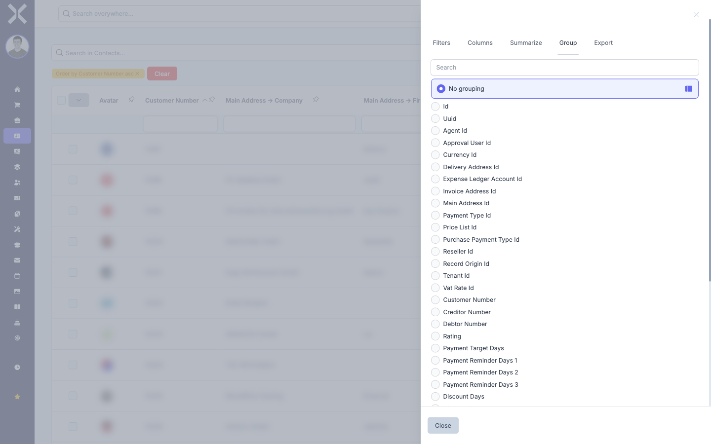

# Grouping

The grouping function combines table entries by a shared attribute. This lets you see at a glance how many entries belong to a particular category.

## Grouping Data

1. Click the icon on the right-hand side of the table to open the sidebar.

2. Select the **Group** tab.

   

3. You will see a list of available columns that can be used for grouping. Each column has a radio button.

4. Click the radio button next to the column you want to group by (e.g. **Payment Type**, **Country**, or **Industry**).

5. The table is restructured immediately. Entries with the same value in the chosen column are combined into a group. Each group shows a header row with the group value and the number of entries it contains.

   

6. Click on a group header to expand or collapse the entries within that group.

## Removing a Grouping

1. Open the sidebar and select the **Group** tab.

2. Deselect the currently active radio button or choose the **No grouping** option (if available).

3. The table returns to its normal, ungrouped view.

## Combining Grouping with Other Functions

Grouping can be combined with all other table features:

- **Search:** The grouping is applied to the search results. Only matching entries appear in the groups.
- **Filters:** Column filters and sidebar filters narrow down the data before the grouping takes effect.
- **Sort:** Within each group, the entries can be sorted.
- **Summarise:** When combined with the summarise function, sums, averages and other calculations are shown per group.

## Related Topics

- [Summarise](4-summarise.md) — Calculate summaries per group
- [Filtering](2-filtering.md) — Filter data before grouping
- [Exporting](6-exporting.md) — Export grouped data
