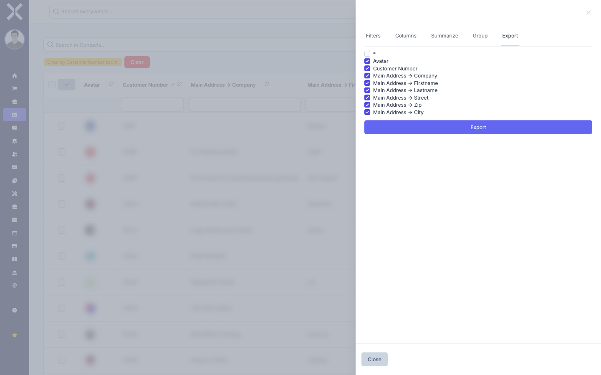

# Exporting

You can export the contents of any data table as a file. The export takes into account the currently active filters, search terms, and visible columns. This way you export exactly the data you see in the table.

## Starting an Export

1. Click the icon on the right-hand side of the table to open the sidebar.

2. Select the **Export** tab.

   

3. You will see a list of all available columns with checkboxes. By default, the currently visible columns are pre-selected.

4. **Adjust columns:** Tick or untick the checkboxes to choose which columns should be included in the export. You can also include columns that are hidden in the table view.

5. Click the **Export** button to start the download.

6. The file is downloaded automatically and saved to your default download folder.

## What Gets Exported?

The export contains exactly the data that is currently displayed in the table:

- **Active filters** are applied. Only filtered entries are exported.
- **Search terms** restrict the export. Only search results are exported.
- **Sort order** is preserved. The order in the export matches the sort order in the table.
- **All pages** are exported, not just the currently visible page. The export includes all entries that match the filters and search criteria.

> **Note:** If you want to export all data without any restrictions, remove all filters and search terms before exporting.

## Related Topics

- [Filtering](2-filtering.md) — Filters determine which data is exported
- [Customise Columns](3-customise-columns.md) — Column selection in the table and in the export
