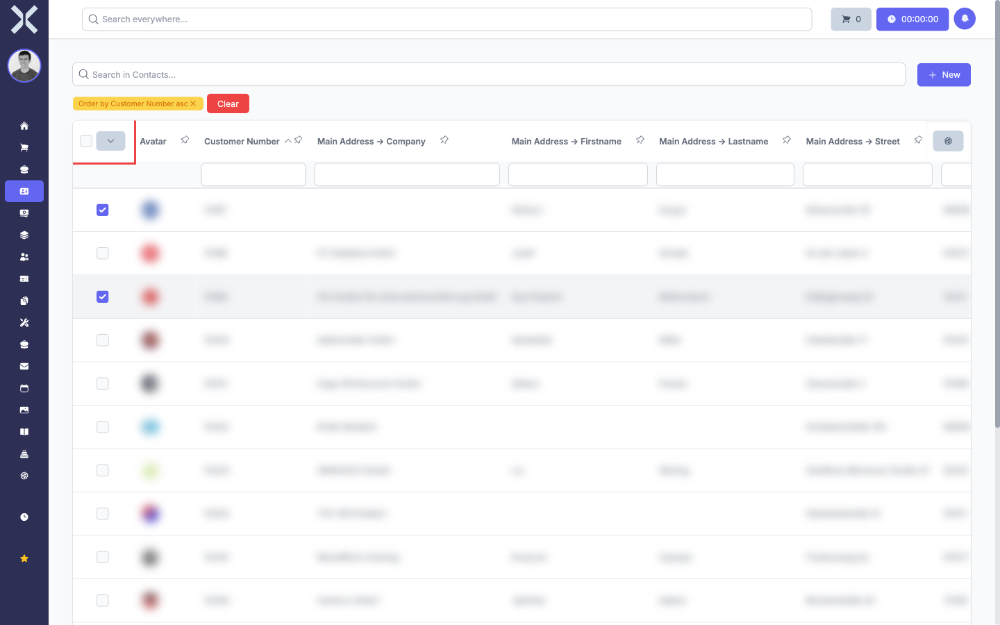

# Selecting Rows

In many tables you can select one or more rows to apply actions to the selected entries. Selected rows are visually highlighted.

## Selecting a Single Row

1. Click the checkbox on the left-hand side of the desired row.

2. The row is highlighted to indicate the selection.

3. Click the checkbox again to deselect the row.

## Selecting Multiple Rows

1. Click the checkboxes of the desired rows one after another. Each clicked row is added to the selection.

   

2. The number of selected rows is displayed above the table.

   

3. To remove a single row from the selection, click its checkbox again.

## Selecting All Rows

1. Click the checkbox in the column header on the far left.

2. All rows on the current page are selected.

3. Click the checkbox in the column header again to deselect all rows.

> **Note:** The selection via the column header applies to the currently displayed page only. Entries on other pages are not automatically selected.

## Applying Actions to Selected Rows

When rows are selected, buttons for available actions appear above the table depending on the context. The available actions depend on the module you are working in. Typical actions include:

- **Delete** — Delete the selected entries
- **Export** — Export only the selected entries
- **Change Status** — Change the status of the selected entries

## Related Topics

- [Exporting](6-exporting.md) — Export selected rows specifically
- [Search and Sort](1-search-and-sort.md) — Narrow down results before selecting rows
