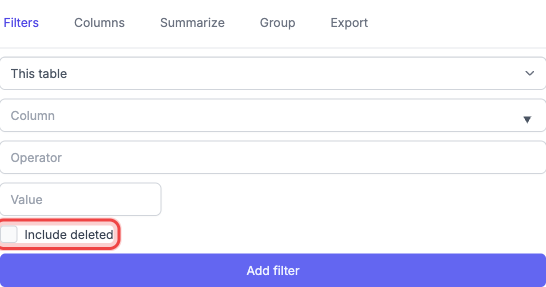
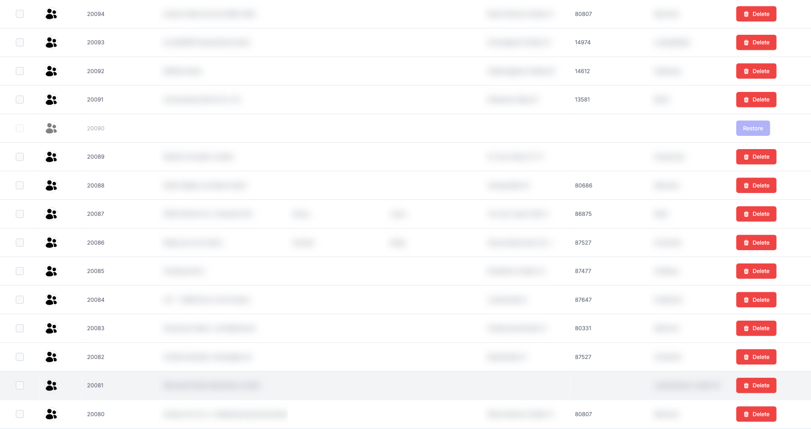
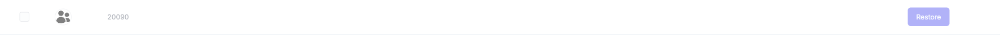

# Deleted Records

In Nuxbe, records in many areas are not permanently deleted but are initially marked as deleted. These so-called "soft-deleted" entries are hidden by default but can be displayed and restored when needed.

## Showing Deleted Records

Whether a table supports deleted records depends on the area. When deleted records exist, you will find the corresponding option in the sidebar.

1. Click the gear icon on the right-hand side of the table to open the sidebar.

2. In the **Edit Filters** tab, you will find the **Include deleted** checkbox at the bottom.

   

3. Enable the checkbox. The table updates immediately and shows the deleted records alongside the active ones.

Deleted records are displayed with reduced opacity so they can be distinguished from active entries.

> **Note:** Deleted records cannot be clicked and cannot be edited. Regular row actions are also hidden for deleted entries.

## Restoring Records

When deleted records are displayed in the table, a **Restore** button appears for each deleted entry.

1. Make sure the **Include deleted** checkbox is enabled (see above).

2. Locate the deleted record in the table. It is recognisable by its reduced opacity.

3. Click the **Restore** button in the actions column of the deleted entry.

   

4. The record is restored immediately and reappears at full opacity as an active entry.

> **Note:** The **Restore** button is only available in tables that support this feature. Not every area allows restoration.

## Related Topics

- [Filtering](2-filtering.md) — More filter options in the sidebar
- [Selecting Rows](7-selecting-rows.md) — Select multiple rows for actions
