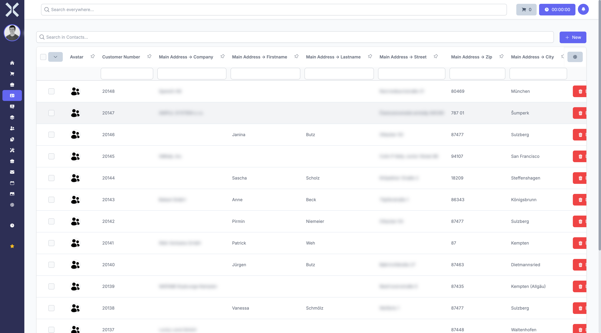

# Manage Contacts

The contact list shows all stored contacts at a glance.

## Open the Contact List

1. Click **Contacts** in the sidebar.

   

2. The table shows all contacts with the following columns:
   - **Customer Number** - Unique contact number
   - **Name** - Company or person name
   - **Debtor Number** - Debtor number for accounting
   - **Payment Type** - Default payment method
   - **Payment Terms** - Agreed payment terms in days

## Search Contacts

Use the search field above the table to filter contacts by name, customer number or other criteria. Results update in real time.

## Use Filters

1. Click **Saved Filters** to access frequently used filter settings.
2. Use the filter row below the column headers to filter by individual columns.

## Create a New Contact

1. Click **New** in the top right corner.
2. Fill in the required fields (name, address, etc.).
3. Click **Save**.

## Related Topics

- [Contact Details](2-contact-detail.md) - View a single contact in detail
- [Addresses](3-addresses.md) - Manage contact addresses
