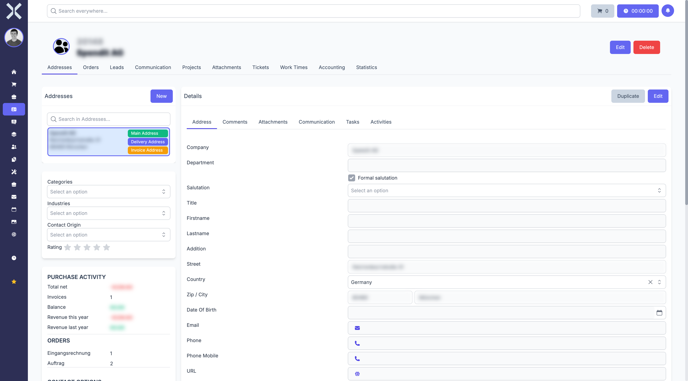

# Contact Details

The detail view shows all information for a single contact.

## Open the Detail View

1. Navigate to the [contact list](1-manage-contacts.md).
2. Click on the desired contact in the table.

   

## Sections of the Detail View

The detail view is divided into several tabs:

### Master Data

The **General** tab contains the basic contact data:

- **Name** - Company or person name
- **Customer Number** - Automatically assigned or manually entered number
- **Debtor Number** - Number for accounting
- **Creditor Number** - Number for suppliers
- **Payment Type** - Default payment method for new orders
- **Payment Terms** - Default payment terms in days

### Addresses

All stored addresses for the contact. See [Manage Addresses](3-addresses.md) for details.

### Communication

Email addresses, phone numbers and other contact methods. See [Communication](4-communication.md) for details.

### Orders

Overview of all linked orders and invoices.

### Bank Details

Stored bank information (IBAN, BIC).

## Edit a Contact

1. Change the desired fields directly in the detail view.
2. Click **Save** to apply the changes.

## Related Topics

- [Manage Contacts](1-manage-contacts.md) - Back to the contact list
- [Orders](../4-orders/0-index.md) - Create orders for this contact
