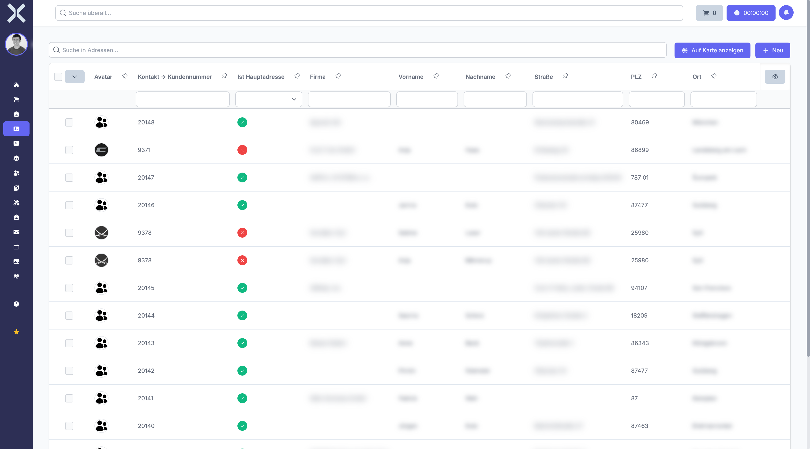

# Addresses

Each contact can have multiple addresses assigned to it. Addresses serve as the basis for invoicing, delivery and correspondence. Each address can have its own contact options (email, phone).

## View Addresses

1. Open the [detail view](2-contact-detail.md) of a contact.
2. Switch to the **Addresses** tab.

   

3. The table shows all stored addresses with the following columns:
   - **Address Type** - Type of address (e.g. main address, delivery address, billing address)
   - **Company** - Company name at this address
   - **Street** - Street and house number
   - **Postal Code** - Postal code
   - **City** - City
   - **Country** - Country of the address

## Address Types

Address types define what an address is used for. The available types are configured in [Settings > Address Types](../14-settings/28-address-types.md). Typical address types are:

- **Main Address** - Primary business address of the contact
- **Delivery Address** - Address for shipping goods
- **Billing Address** - Address for invoicing
- **Location** - Additional company location

You can create any number of additional address types in the settings.

### Different Billing Addresses per Order

A contact can have multiple addresses. When creating an order, you select which address should be used as the billing address for that order. This allows different invoices for the same customer to be sent to different departments or locations.

> **Example:** The company "Sample Ltd." has its headquarters in London and a branch office in Manchester. Create both addresses under the contact "Sample Ltd." and select the appropriate billing address when creating each order.

## Main Address

The first address created for a contact is treated as the main address. It is used by default as the billing and delivery address for new orders. The contact list displays the data from the main address.

To set a different address as the default for invoicing or delivery, assign the appropriate address type to the corresponding address.

## Address Fields

Each address has the following fields:

| Field | Description |
|---|---|
| **Company** | Company name at this address. May differ from the contact name, e.g. for branch offices. |
| **Salutation** | Salutation for the contact person at this address (e.g. Mr, Mrs) |
| **Title** | Academic title (e.g. Dr, Prof.) |
| **First Name** | First name of the contact person |
| **Last Name** | Last name of the contact person |
| **Addition** | Address addition (e.g. department, building, floor) |
| **Street** | Street and house number |
| **Postal Code** | Postal code |
| **City** | City |
| **Country** | Country of the address. Selected from the country list. |
| **Address Type** | Type of address (see above) |

## Add a New Address

1. Click **New** in the address tab.
2. Fill in the address fields. Required fields are marked with an asterisk.
3. Select the appropriate **Address Type** from the dropdown.
4. Click **Save**.

The new address then appears in the address list of the contact.

## Edit an Address

1. Click on the desired address in the table.
2. Change the relevant fields.
3. Click **Save**.

## Delete an Address

1. Click **Delete** next to the desired address.
2. Confirm the deletion in the displayed dialog.

Note that addresses that are already used in orders cannot be deleted.

## Contact Options per Address

Each address can have its own contact options. This allows you to store a different phone number or email address for a delivery address, for example.

The contact options at the address level work in the same way as the contact options at the contact level. For more information, see [Communication](4-communication.md).

When creating an order, the contact options of the selected address are used. This ensures that the correct email address is used for sending invoices.

> **Important:** The automatic email sending of payment reminders preferably uses the email address of the **order's billing address**. If no email is stored there, the system falls back to the contact's billing address and then to the main address. Make sure a valid email address is stored on the respective billing address. For more details, see [Reminders](../5-accounting/2-reminders.md).

## Related Topics

- [Contact Details](2-contact-detail.md) - Back to the contact detail view
- [Communication](4-communication.md) - Manage contact options
- [Settings > Address Types](../14-settings/28-address-types.md) - Configure address types
- [Settings > Countries](../14-settings/2-countries.md) - Manage the country list
- [Reminders](../5-accounting/2-reminders.md) - Payment reminders and dunning
