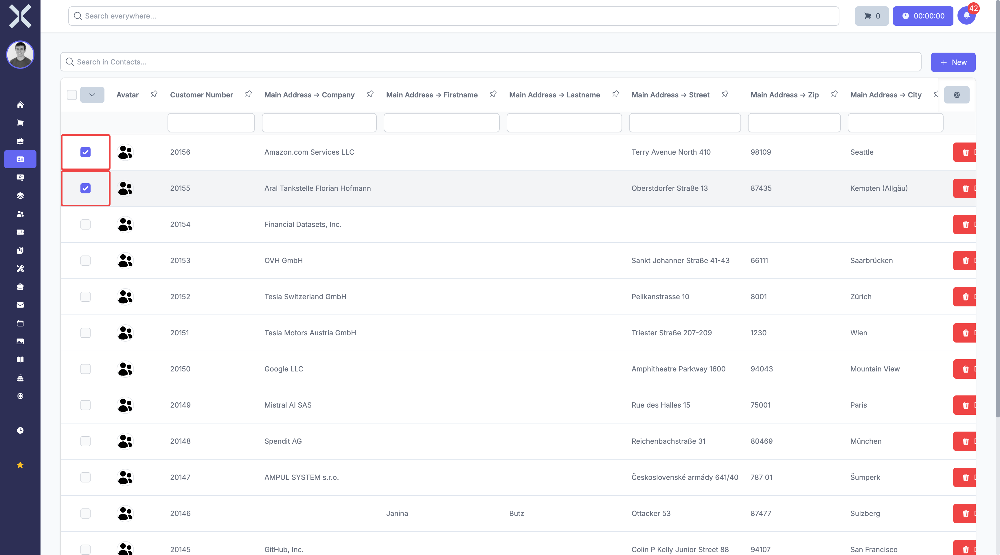
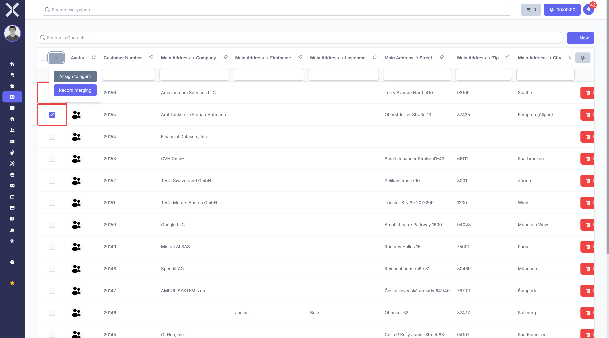
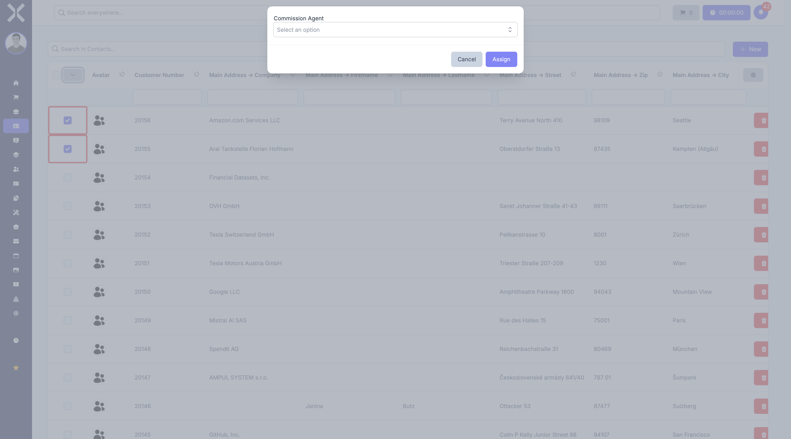

# Assign Representative

The **Assign to agent** function allows you to assign a new sales representative to multiple contacts at once. This is particularly useful when an employee leaves the company and their customers need to be transferred to another representative.

## Prerequisites

- You need permission to edit contacts.
- The desired representative must be set up as an active user in the system.

## Change the Representative for Multiple Contacts

1. Navigate to **Contacts**.

2. Select the contacts you want to assign to a new representative by clicking the checkboxes on the left side of each row.

   

3. Click the dropdown arrow next to the checkbox in the column header. The **Assign to agent** button appears below the header row.

   

4. Click **Assign to agent**. A dialog opens.

   

5. Click the **Select an option** field and choose the desired representative from the list. You can type a name in the search field to filter the list.

   

6. Click **Assign**. Confirm the change in the confirmation dialog that appears.

All selected contacts will be assigned to the new representative.

## Tips

- Use the filters and search in the contact list to find all contacts of a specific representative before making your selection.
- Use the checkbox in the column header to select all contacts on the current page at once.

## Related Topics

- [Manage Contacts](1-manage-contacts.md) - Contact list, search and filters
- [Contact Details](2-contact-detail.md) - View a single contact in detail
