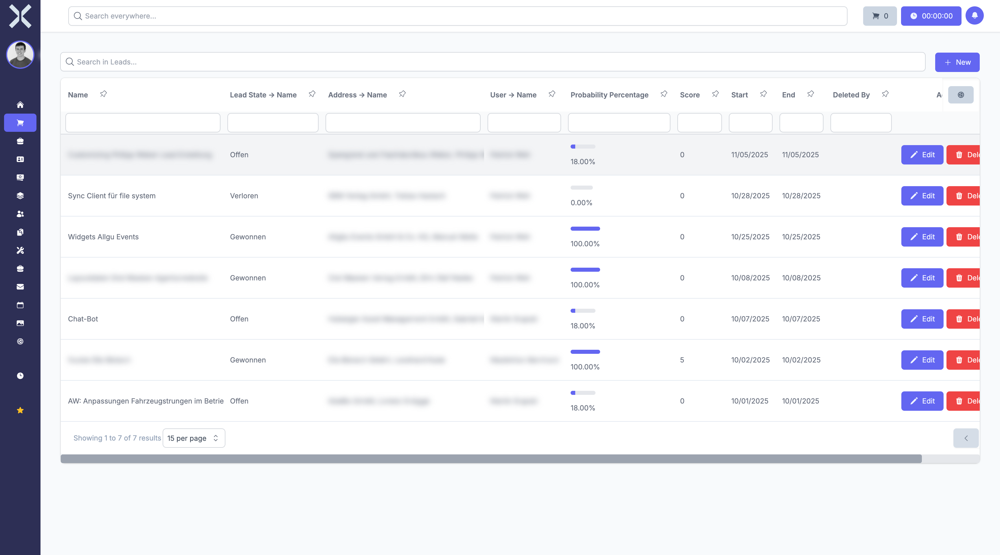

# Sales

In the **Sales** module you manage your leads and the sales pipeline.

## Overview

Navigate to **Sales** via the sidebar. The submenu contains the option **Leads**.

## Leads

The leads overview shows all your sales contacts in a tabular view.

The table shows typical columns such as:

- **Name** - Name of the lead
- **Status** - Current stage in the sales process
- **Contact** - Linked contact
- **Created At** - Creation date

## Features

- **Search** - Use the search field to quickly find leads.
- **New Lead** - Click **New** to create a new lead.
- **Filter** - Filter leads by various criteria.

## Pages in this Chapter

- [Manage Leads](1-manage-leads.md) - Lead list, search and filters
- [Lead Details](2-lead-detail.md) - Detail view of a lead
