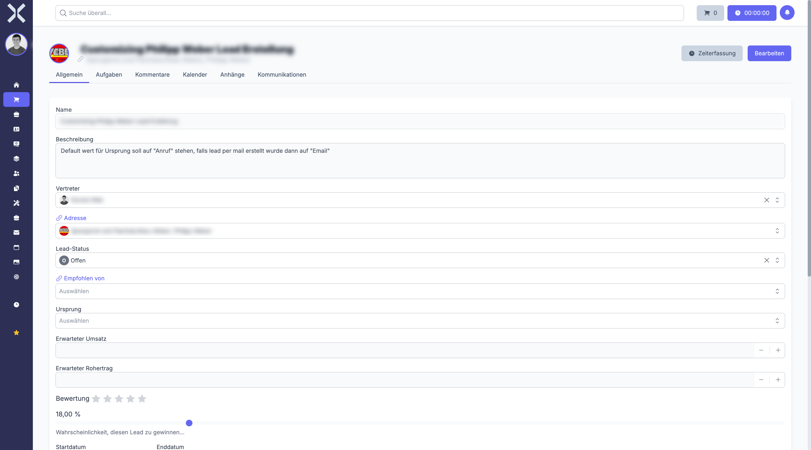

# Lead Details

The detail view shows all information for a single lead and allows you to edit it.

## Open the Detail View

1. Navigate to the [lead list](1-manage-leads.md).
2. Click on the desired lead in the table.

   

## Sections

### Master Data

- **Name** - Lead name
- **Status** - Current stage (e.g. New, Qualified, Proposal, Won, Lost)
- **Contact** - Linked contact from the contact management
- **Responsible** - Assigned sales representative
- **Expected Revenue** - Estimated order value
- **Closing Date** - Expected closing date

### Activities

View the history of all activities for the lead (calls, emails, notes).

## Edit a Lead

1. Change the desired fields in the detail view.
2. Click **Save** to apply the changes.

## Change Lead Status

1. Select the new status from the **Status** dropdown.
2. Click **Save**.

> **Note:** When a lead reaches the **Won** status, an order can be created directly from it.

## Related Topics

- [Manage Leads](1-manage-leads.md) - Back to the lead list
- [Orders](../4-orders/0-index.md) - Create an order from a lead
