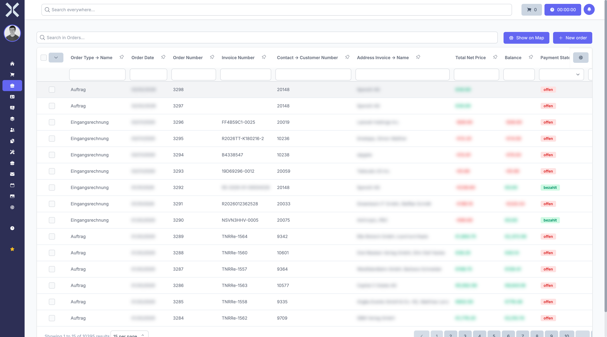

# Orders

In the **Orders** module you manage quotes, orders, invoices and other order types.

## Overview

Navigate to **Orders** via the sidebar. The submenu contains various order types, selectable via tabs in the list view.

The table shows all orders with columns such as:

- **Order Number** - Unique order number
- **Order Type** - Type of order (e.g. order, invoice, quote)
- **Contact** - Associated customer or supplier
- **Invoice Number** - Assigned invoice number
- **Net Amount / Gross Amount** - Order amounts
- **Created At** - Creation date

## Features

- **Search** - Search orders by number, contact or other criteria.
- **Saved Filters** - Use predefined filters for frequent queries.
- **New Order** - Click **New** to create a new order.

## Order Details

Click on an order to open the detail view.

In the detail view you will find:

- **Header Data** - Order number, order type, status and contact details
- **Positions** - Individual line items with products, quantities and prices
- **Documents** - Attached files and generated documents
- **Actions** - Buttons to duplicate, delete or save the order

## Pages in this Chapter

- [Manage Orders](1-manage-orders.md) - Order list, search and filters
- [Order Details](2-order-detail.md) - Detail view of an order
- [Order Positions](3-order-positions.md) - Manage positions within an order
- [Order Positions List](4-order-positions-list.md) - All positions across orders

## Related Topics

- [Contacts](../2-contacts/0-index.md) - Manage customers and suppliers
- [Products](../6-products/0-index.md) - Products for order positions
- [Accounting](../5-accounting/0-index.md) - Transactions and payment assignments
