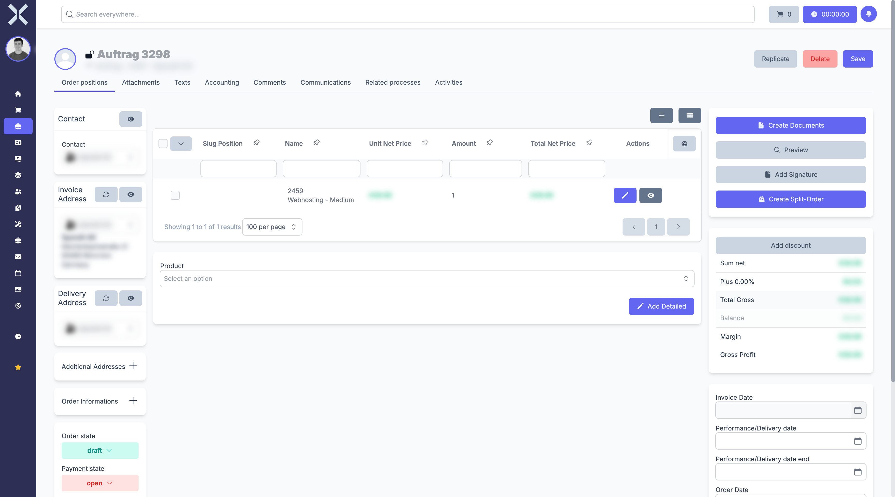

# Order Details

The detail view shows all information for a single order.

## Open the Detail View

1. Navigate to the [order list](1-manage-orders.md).
2. Click on the desired order.

   

## Sections

### Header Data

- **Order Number** - Automatically assigned number
- **Order Type** - Type of order
- **Status** - Current processing status
- **Contact** - Linked customer/supplier
- **Billing Address** - Address for invoicing
- **Delivery Address** - Address for delivery

### Positions

Overview of all order positions with items, quantities and prices. See [Order Positions](3-order-positions.md) for details.

### Documents

Attached files and generated documents (e.g. PDF invoices).

### Actions

- **Save** - Apply changes
- **Duplicate** - Copy the order
- **Delete** - Delete the order
- **Schedule** - Subscriptions only: Configure the recurrence schedule
- **Cancellation** - Subscriptions only: Start the cancellation process

> **Note:** Not all actions are available at all times. The display adapts to the current status and order type. The individual order types and their specific features are documented under [Order Types](5-order-types/0-index.md).

## Related Topics

- [Manage Orders](1-manage-orders.md) - Back to the order list
- [Order Positions](3-order-positions.md) - Edit positions
