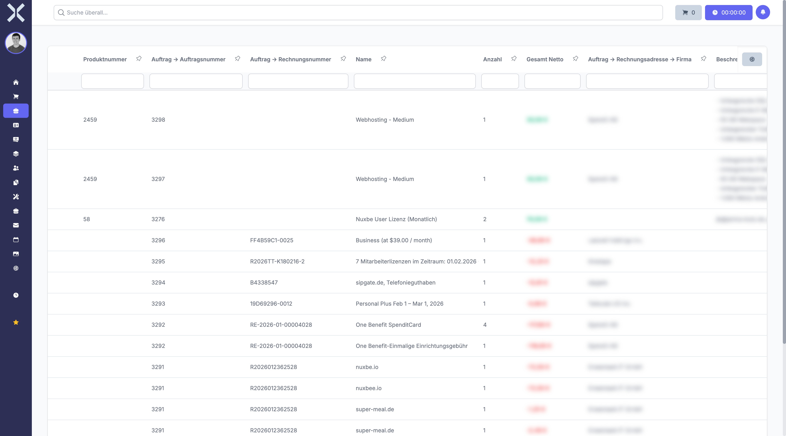

# Order Positions

Order positions are the individual line items within an order. Each position contains a product or service with quantity and price.

## View Positions

1. Open the [detail view](2-order-detail.md) of an order.
2. The positions are shown in the **Positions** section.

   

## Add a New Position

1. Click **Add Position** in the positions section.
2. Select a **Product** from the catalogue or enter a free-text description.
3. Enter the **Quantity**.
4. The **Price** is automatically taken from the product catalogue but can be adjusted manually.
5. Click **Save**.

## Edit a Position

1. Click on the desired position in the table.
2. Change quantity, price or description.
3. Click **Save**.

## Delete a Position

1. Click the **Delete** icon next to the position.
2. Confirm the deletion.

## Related Topics

- [Order Details](2-order-detail.md) - Back to the order detail view
- [Products](../6-products/0-index.md) - Manage the product catalogue
