# Subscriptions (Recurring Orders)

Subscriptions are orders that automatically create follow-up documents at regular intervals. Typical use cases include monthly hosting fees, quarterly maintenance contracts, or annual license billing. Nuxbe automatically creates invoices, can generate them as PDFs, and send them to the customer via email.

## How Subscriptions Work

A subscription consists of two parts:

1. **The order** - A regular order with positions, contact, prices, etc. The only difference: the order type is **Subscription** instead of e.g. "Invoice" or "Order".
2. **The schedule** - A configuration that defines: *When* should the next document be created? *How often*? *Until when*?

When the schedule is due, Nuxbe automatically creates a copy of the subscription order as a new document (e.g. an invoice). The positions, prices, and contact data are carried over from the subscription.

## Creating a Subscription

### Step 1: Create a New Order

1. Navigate to **Orders**.
2. Click **New**.
3. Select **Subscription** as the **Order Type**.

   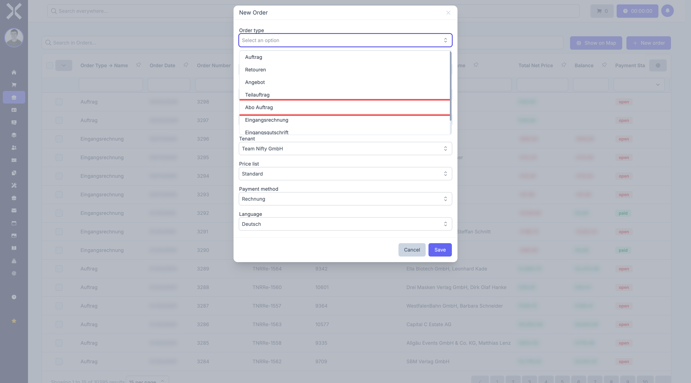

4. Select the **Contact** (customer).
5. Fill in the header data (payment type, payment terms, etc.) -- just like a regular order.
6. Click **Save**.

### Step 2: Add Positions

Add the products or services that should be billed with each renewal. These positions are carried over into every automatically created follow-up document.

1. Click **Add Position**.
2. Select a product or enter free text.
3. Set quantity and price.
4. Repeat for all positions.
5. Click **Save**.

> **Important:** The positions in the subscription serve as a template for all automatically created follow-up documents. If you enter "Web Hosting - 1 Month" at 29.90 EUR here, every renewal will create a new document with exactly this position and price.

### Step 3: Set Up the Schedule

After saving the subscription order, you will see two additional buttons in the left column (sidebar) that only appear for subscriptions:

- **Schedule** (blue clock icon) - Configure the recurrence pattern here
- **Cancellation** (amber X icon) - Cancel the subscription here

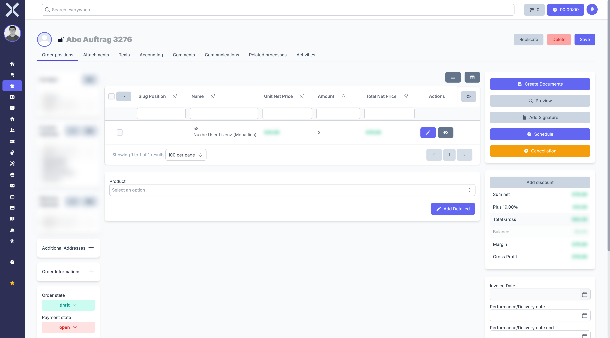

Click **Schedule** to open the schedule dialog.

## The Schedule in Detail

The schedule dialog is the core of subscription management. Here you define when and how often new documents are automatically created. In the following section, **every single field** of the schedule dialog is explained in detail.

### Field: Order Type

The **Order Type** field defines what type of document Nuxbe should create with each automatic execution. Click on the dropdown field and select the desired order type.

**What does this mean?** Your subscription is essentially the "template". Every time the schedule is due, Nuxbe creates a new document from it. The order type determines what kind of document that is:

- **Invoice** -- Nuxbe creates an invoice directly. This is the most common choice when you want to bill the customer automatically.
- **Order** -- Nuxbe creates an order. You then need to manually turn it into an invoice. This is useful when you want to review or adjust the document before invoicing.

> **Important:** This is **not** the order type of the subscription itself (which is always "Subscription"). It is the order type of the new document that is automatically created from it. Think of the subscription as a stencil, and the order type as "What should be made from this stencil?".

### Field: Repeat

The **Repeat** field determines the rhythm in which new documents are created. Click on the dropdown field to see the available options.

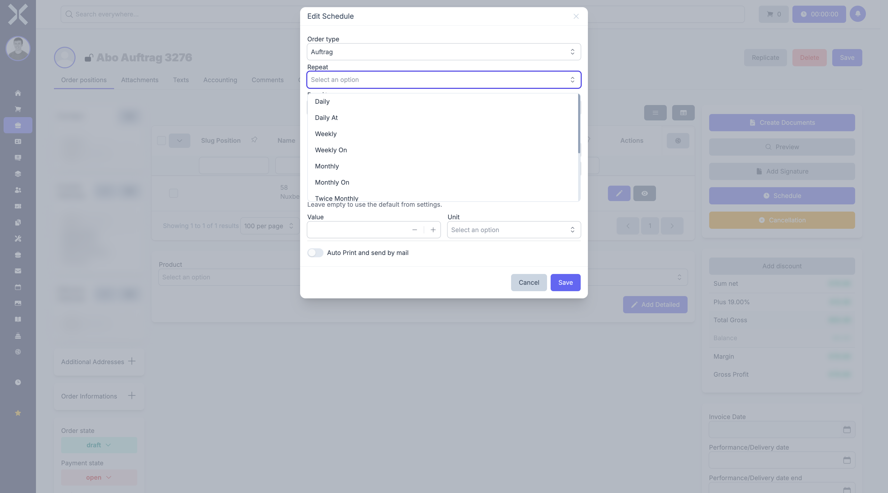

There are 12 different options. These can be divided into two groups:

#### Simple Frequencies (without "On")

With the simple frequencies (e.g. **Monthly**, **Weekly**, **Yearly**), Nuxbe decides on its own when exactly the document is created. **No additional fields** are displayed -- you only set the interval.

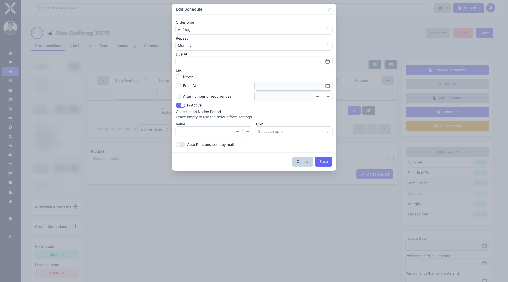

The system uses the date in the **Due At** field as its reference point: If that field contains e.g. February 15th and you choose "Monthly", the next document will be created on March 15th, then April 15th, and so on.

| Repeat | Meaning |
|---|---|
| **Daily** | Every day |
| **Weekly** | Once per week |
| **Monthly** | Once per month |
| **Quarterly** | Every three months |
| **Yearly** | Once per year |

#### Frequencies with "On" -- You Determine the Exact Timing

With the variants that include **"On"** (e.g. **Monthly On**, **Weekly On**, **Yearly On**), you can **specify exactly** on which day and at what time the document should be created. As soon as you select an "On" variant, additional input fields appear.

**Weekly On** -- Here the fields **Weekday** and **Time** appear:

- **Weekday** -- Select the desired weekday from the list (Monday, Tuesday, Wednesday, Thursday, Friday, Saturday, or Sunday).
- **Time** -- Enter the desired time (e.g. 06:00).

> **Example:** You select "Weekly On", weekday "Monday", and time "09:00". Then a new document will be created every Monday at 9:00 AM.

**Monthly On** and **Quarterly On** -- Here the fields **Day** and **Time** appear:

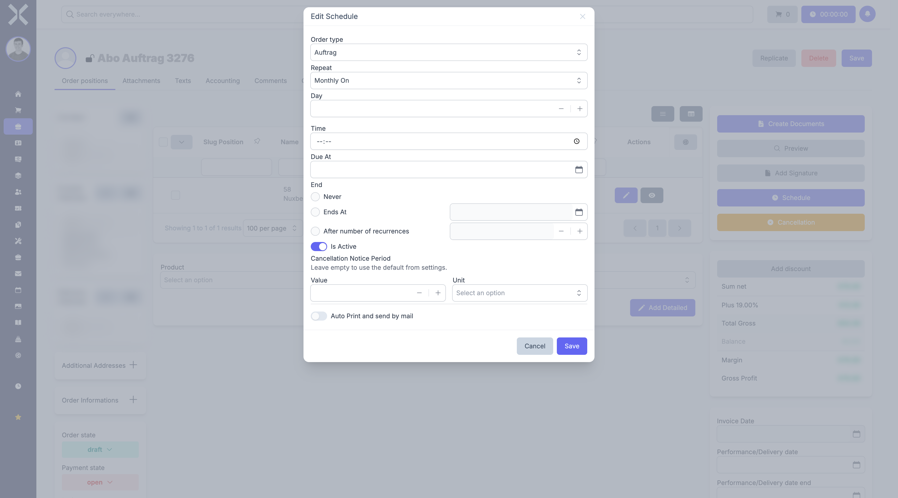

- **Day** -- On which day of the month should the document be created? Enter a number from 1 to 31. If you enter 1, for example, the document will always be created on the first of the month.
- **Time** -- At what time should the document be created?

> **Example:** You select "Monthly On", day "1", and time "06:00". Then an invoice will be created on the 1st of every month at 6:00 AM.

**Yearly On** -- Here the fields **Month**, **Day**, and **Time** appear:

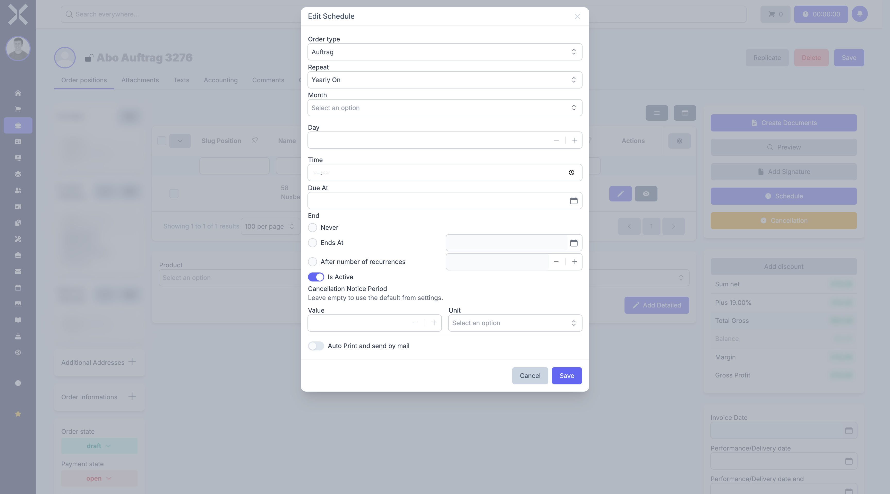

- **Month** -- In which month should the document be created? Select from the list (January through December).
- **Day** -- On which day of that month?
- **Time** -- At what time?

> **Example:** You select "Yearly On", month "January", day "1", and time "06:00". Then an invoice will be created every year on January 1st at 6:00 AM.

#### Special Cases: Additional Options

| Repeat | Meaning | Additional Fields |
|---|---|---|
| **Daily At** | Every day at a fixed time | Time |
| **Twice Monthly** | Twice per month | First Day, Second Day, Time |
| **Last Day Of Month** | On the last day of every month (28th, 29th, 30th, or 31st -- depending on the month) | Time |

> **Summary:** Use the simple variants (without "On") when you do not care about the exact timing and want to base it on the due date. Use the "On" variants when you want to specify exactly on which day and at what time the document should be created.

### Field: Due At (Start Date)

The **Due At** field determines when the first (or next) automatic execution takes place. Click on the field or the calendar icon next to it to select a date.

**What should you enter here?**

- **For a new subscription:** Enter the date on which the **very first** document should be created. If you want the first invoice to be created on March 1st, for example, enter 03/01/2025 here.
- **For a running subscription:** This field is updated automatically. After each automatic execution, the date advances to the next due date. You do not need to change anything here.

> **Example:** You set up a monthly subscription on January 15th and set "Due At" to February 1st. On February 1st, the first document is created. After that, "Due At" automatically advances to March 1st, then to April 1st, and so on.

### Latest Cancellation Date

Below the due date, Nuxbe sometimes shows an amber notice with the **latest cancellation date**. This date is calculated automatically: Nuxbe takes the next due date and subtracts the cancellation notice period from it.

**What does this mean?** If a customer wants to cancel their subscription, they must do so **before** this date. Otherwise, the cancellation will only take effect after the renewal period following the next one.

> **Example:** The next due date is April 1st and the cancellation notice period is 1 month. Nuxbe then shows March 1st as the latest cancellation date. If the customer cancels on March 15th, the deadline has already passed -- the subscription will only end on May 1st.

### Field: End

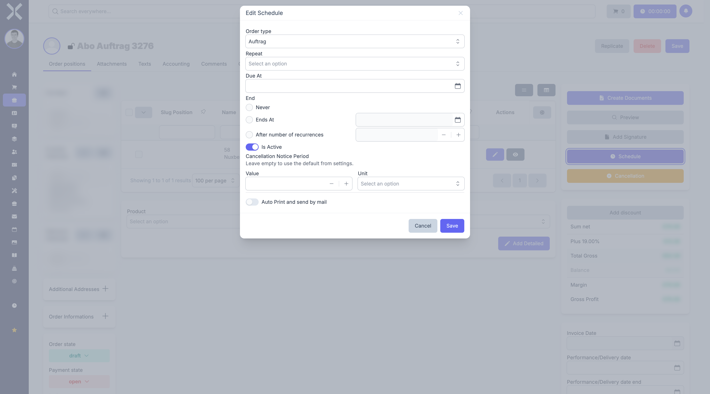

In the **End** section, you define whether and when the subscription should stop. There are three options, which you can switch between by clicking on the respective radio button:

#### Never (Default)

The subscription continues indefinitely until it is manually cancelled. This is the default setting and the right choice for most subscriptions.

> **When to choose "Never"?** When the subscription should run until the customer actively cancels -- e.g. for hosting contracts, ongoing maintenance agreements, or memberships.

#### Ends At (specific date)

The subscription will not be renewed after a specific date. When you select this option, the date field next to it becomes active and you can enter an end date.

- Click on **Ends At**.
- Click on the date field next to it and select the desired end date.

> **Example:** A maintenance contract runs from January 1, 2025 to December 31, 2025. Set "Ends At" to 12/31/2025. After this date, no more documents will be created.

#### After Number of Recurrences

The subscription ends automatically after a specific number of executions. When you select this option, the number field next to it becomes active.

- Click on **After Number of Recurrences**.
- Enter the desired number (or use the plus/minus buttons).

> **Example:** You want exactly 12 monthly invoices (a one-year contract with monthly billing). Select "After Number of Recurrences" and enter 12. After the 12th invoice, the subscription stops automatically.

If executions have already taken place, the **current recurrence** is displayed below (e.g. "3 of 12").

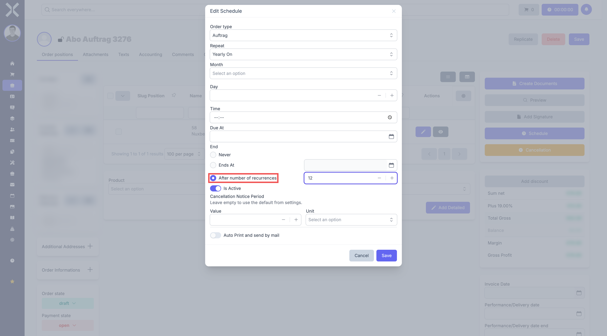

### Field: Is Active

The **Is Active** toggle controls whether the schedule is currently active or not. When the toggle is **switched on** (blue), documents are automatically created as soon as the due date is reached. When the toggle is **switched off**, nothing happens -- the schedule is skipped.

**When should you switch it off?**

- You want to temporarily pause a subscription without deleting the schedule entirely.
- You are setting everything up first and want to activate the schedule later.
- There is a problem with the customer and you want to temporarily stop the automatic billing.

> **Important:** If you switch the toggle off and later switch it back on, check the due date. You may need to manually set it to a future date so that the schedule does not immediately catch up on all "missed" documents.

### Field: Cancellation Notice Period

In the **Cancellation Notice Period** section, you can define how far in advance of the next renewal date the customer must cancel. This setting applies only to this one subscription and overrides the global default from the [Subscription Settings](../../14-settings/14-subscription-settings.md).

The cancellation notice period consists of two fields:

- **Value** -- A number (e.g. 1, 3, 30). Use the plus/minus buttons or type the number directly.
- **Unit** -- The time unit. Click on the dropdown and select: Days, Weeks, Months, or Years.

> **Example:** You want the customer to cancel at least 3 months before the next renewal. Enter "3" for the value and select "Months" as the unit.

> **Note:** If you leave both fields empty, Nuxbe will use the default value from the [Subscription Settings](../../14-settings/14-subscription-settings.md). This is convenient when most of your subscriptions share the same cancellation notice period.

### Field: Auto Print and Send by Email

At the very bottom of the schedule dialog, you will find the **Auto Print and send by mail** toggle. When you activate this toggle, Nuxbe will not only create the document with each automatic execution, but also:

1. Generate a PDF (e.g. the invoice as a PDF file)
2. Send this PDF by email to the customer

As soon as you activate the toggle, two additional fields appear:

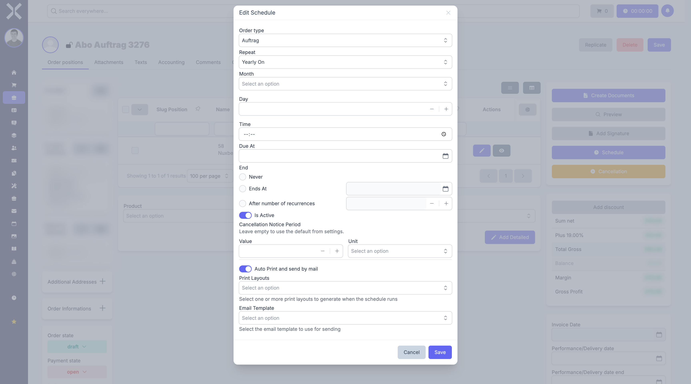

- **Print Layouts** -- Click **Select** and choose one or more print layouts that should be generated as PDF. A print layout determines how the invoice (or the order) looks as a PDF.
- **Email Template** -- Click **Select** and choose the email template to use for sending. This template contains the email text and is populated with the data from the document.

> **Example:** You want every monthly renewal to automatically create an invoice as a PDF and send it to the customer by email. Activate the toggle, select your invoice print layout, and choose the appropriate email template. From now on, you do not have to worry about a thing -- Nuxbe does everything automatically.

> **Note:** Email templates can be created and edited in the [Settings > Email Templates](../../14-settings/25-email-templates.md).

### Saving the Schedule

Once you have filled in all the fields, click **Save**. The schedule is now active (provided the "Is Active" toggle is switched on). Nuxbe will automatically create new documents according to your schedule as soon as the due date is reached.

## Cancelling a Subscription

To end a running subscription:

1. Open the subscription order.
2. Click **Cancellation** (amber X icon in the sidebar).

The cancellation dialog offers two options:

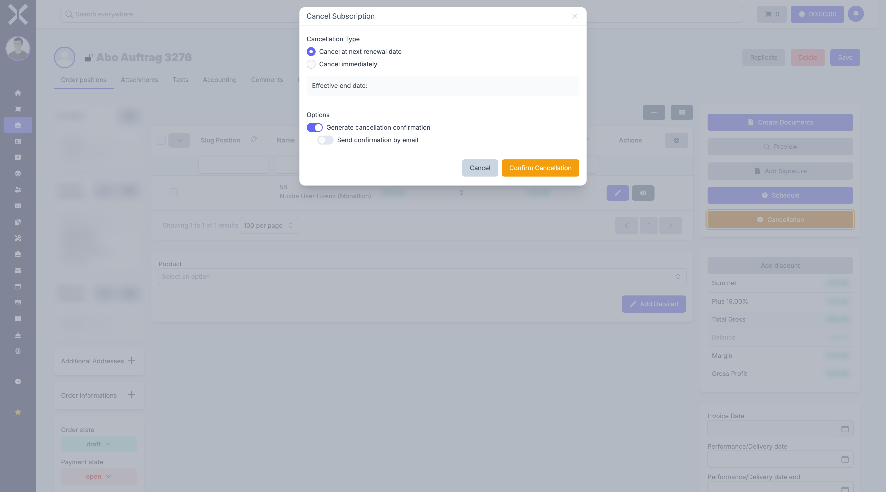

### Cancel at Next Renewal Date

The subscription continues until the next scheduled renewal date and then ends. This is the default option.

- Select **Cancel at next renewal date**.
- The displayed **Effective end date** shows when the subscription actually ends.

### Cancel Immediately

The subscription is ended immediately. No further documents will be created.

- Select **Cancel immediately**.
- The effective end date is today's date.

### Late Cancellation Warning

If the cancellation notice period has already expired, Nuxbe shows a red warning. In this case, the cancellation takes effect after the period following the next renewal.

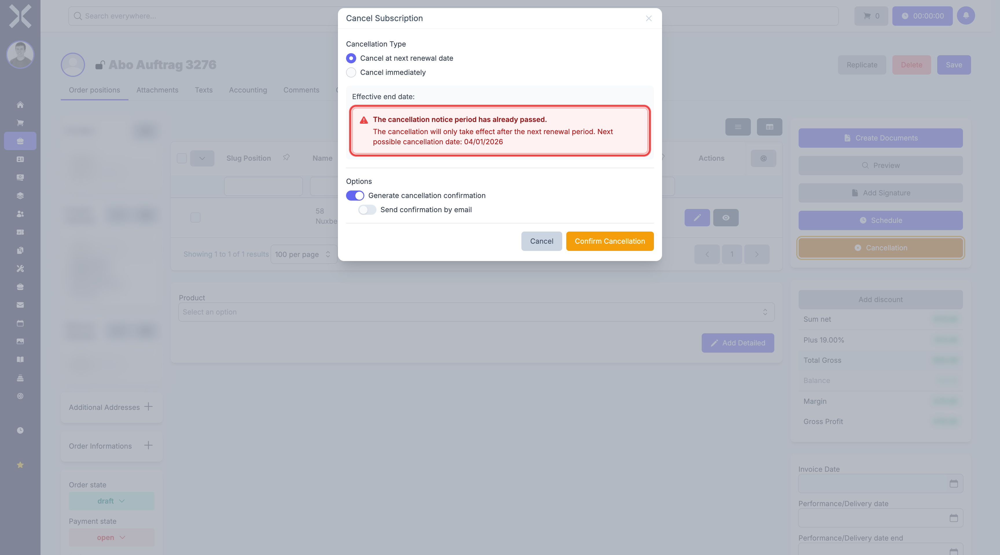

### Cancellation Confirmation

Additionally, you can choose whether a cancellation confirmation should be generated:

- **Generate cancellation confirmation** - Creates a confirmation document (uses the [cancellation text from settings](../../14-settings/14-subscription-settings.md))
- **Send confirmation by email** - Automatically sends the confirmation to the customer (only available when generation is enabled)

Click **Confirm Cancellation** to complete the process.

## What Happens in the Background?

For subscriptions to be processed automatically, a cron job must be set up on the server. This checks regularly (typically once per minute) whether any subscriptions are due.

When a subscription is due, the following happens:

1. Nuxbe copies the subscription order and creates a new document from it (e.g. an invoice).
2. The positions, prices, contact data, and texts are carried over from the subscription.
3. The performance period of the subscription is updated.
4. If configured: The invoice is generated as a PDF and sent via email.
5. The due date of the schedule automatically moves to the next date.
6. The current recurrence counter is incremented by 1.

The generated documents can then be found in the [order list](../1-manage-orders.md) and in the document chain of the subscription order (right column of the detail view under **Related Documents**).

## Practical Examples

### Monthly Hosting

- **Order Type:** Subscription
- **Positions:** "Web Hosting Premium" - 1 unit - 29.90 EUR/month
- **Repeat:** Monthly On the 1st at 6:00 AM
- **Due At:** February 1, 2025
- **End:** Never
- **Follow-up Order Type:** Invoice
- **Auto Print and Send:** Yes, with invoice layout and standard email template
- **Cancellation Notice:** 1 month

**Result:** On the 1st of every month at 6:00 AM, an invoice is automatically created, generated as PDF, and sent to the customer via email.

### Quarterly Maintenance

- **Order Type:** Subscription
- **Positions:** "Server Infrastructure Maintenance" - 1 unit - 750.00 EUR/quarter
- **Repeat:** Quarterly On the 1st at 8:00 AM
- **Due At:** April 1, 2025
- **End:** Never
- **Follow-up Order Type:** Invoice
- **Cancellation Notice:** 3 months

### Annual License with Limited Duration

- **Order Type:** Subscription
- **Positions:** "Enterprise Software License" - 10 units - 199.00 EUR/year
- **Repeat:** Yearly On January 1st at 6:00 AM
- **Due At:** January 1, 2026
- **End:** After 3 recurrences (3-year contract)
- **Follow-up Order Type:** Invoice
- **Cancellation Notice:** 3 months

## Frequently Asked Questions

### Can I change the positions of a running subscription?

Yes. Open the subscription order and edit the positions like any other order. From the next automatic execution onward, the new positions and prices will be used. Already created invoices remain unchanged.

### Can I change the schedule after it has been set up?

Yes. Open the subscription order, click **Schedule**, and adjust the settings. The changes take effect from the next due date.

### What happens if the server is down at the scheduled time?

The document is created on the next cron job run. Nuxbe detects that the due date has passed and processes it retroactively.

### Where can I see which documents were created from a subscription?

Open the subscription order. In the right column under **Related Documents**, you can see all automatically created follow-up documents (invoices, orders, etc.).

### Can I reactivate a cancelled subscription?

Yes. Open the schedule and set the **Is Active** toggle back to On. Adjust the due date and end condition as needed.

## Related Topics

- [Manage Orders](../1-manage-orders.md) - Order list and filters
- [Order Details](../2-order-detail.md) - General order details
- [Order Positions](../3-order-positions.md) - Edit positions
- [Subscription Settings](../../14-settings/14-subscription-settings.md) - Global defaults for cancellation periods and texts
- [Order Types](../../14-settings/11-order-types.md) - Configure order types
- [Email Templates](../../14-settings/25-email-templates.md) - Set up templates for automatic sending
