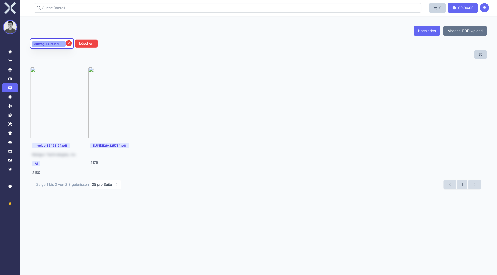

# Purchase Invoices

In the **Purchase Invoices** section you record and manage invoices from suppliers.

## Overview

1. Navigate to **Accounting > Purchase Invoices**.

   

2. The table shows all recorded purchase invoices.

## Record a New Purchase Invoice

1. Click **New**.
2. Upload the invoice document or enter the data manually.
3. Assign the invoice to a **Supplier** (contact).
4. Select the **Ledger Account** for booking.
5. Enter the **Amount** and **Invoice Date**.
6. Click **Save**.

## Process a Purchase Invoice

1. Click on a purchase invoice to open it.
2. Review the data and adjust if necessary.
3. Click **Process** to post the invoice in accounting.

## Related Topics

- [Accounting](0-index.md) - Back to the accounting overview
- [Contacts](../2-contacts/0-index.md) - Manage supplier data
