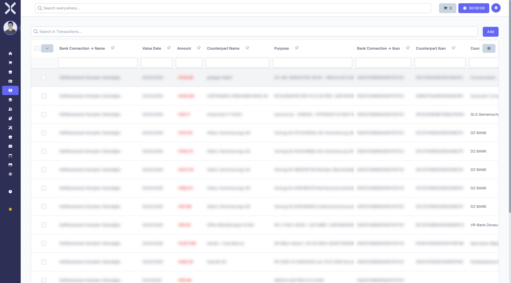

# Transactions

In the **Transactions** section you view all bank transactions and account movements.

## Overview

1. Navigate to **Accounting > Transactions**.

   

2. The table shows all transactions with the following columns:
   - **Bank Account** - Name of the associated bank account
   - **Value Date** - Date of the value entry
   - **Amount** - Transaction amount
   - **Counterpart Name** - Name of the payee or payer
   - **Purpose** - Transaction description
   - **Bank Account IBAN** - IBAN of your own account
   - **Counterpart IBAN** - IBAN of the counterpart

## Search Transactions

Use the search field to search transactions by purpose, counterpart or amount.

## Related Topics

- [Transaction Assignments](5-transaction-assignments.md) - Assign transactions to orders
- [Accounting](0-index.md) - Back to the accounting overview
