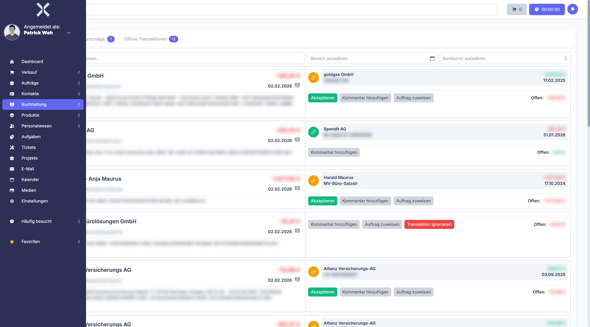

# Transaction Assignments

In the **Transaction Assignments** section you assign bank transactions to the corresponding orders and invoices.

## Overview

1. Navigate to **Accounting > Transaction Assignments**.

   

2. The table shows all assignments between transactions and orders.

## Assign a Transaction

1. Find the desired transaction.
2. Click **Assign**.
3. Select the matching order or invoice.
4. Confirm the assignment.

> **Note:** Check the purpose and amount carefully to ensure a correct assignment.

## Related Topics

- [Transactions](4-transactions.md) - View the transactions list
- [Orders](../4-orders/0-index.md) - View related orders
