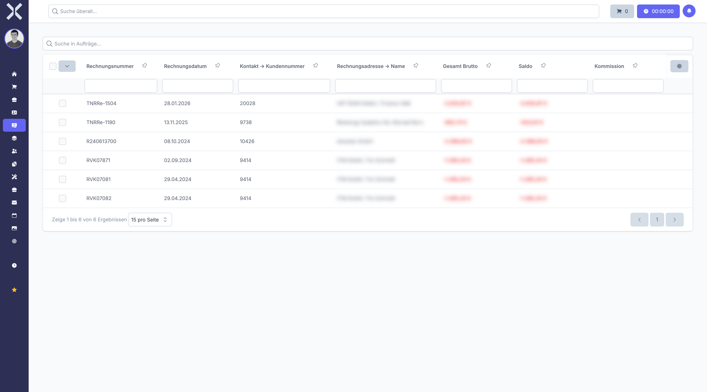

# Transfers

In the **Transfers** section you create and manage bank transfers to suppliers.

## Overview

1. Navigate to **Accounting > Transfer**.

   

2. The table shows all planned and completed transfers.

## Create a Transfer

1. Click **New**.
2. Select the recipient (supplier/contact).
3. Enter the amount and purpose.
4. Click **Save**.

## Related Topics

- [Accounting](0-index.md) - Back to the accounting overview
- [Payment Runs](8-payment-runs.md) - Process batch payments
